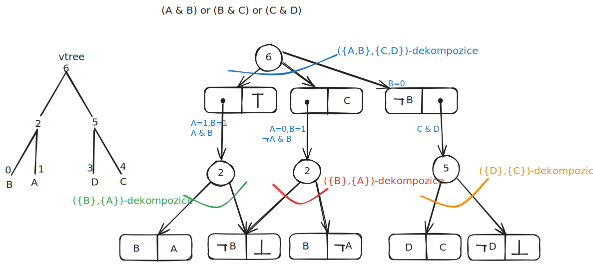
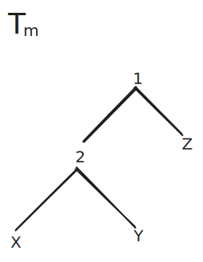
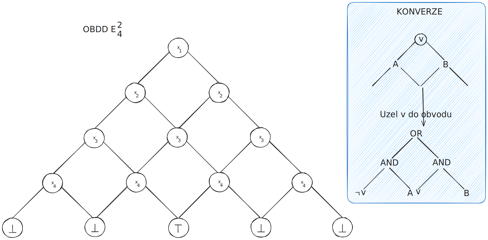

# Sentential Decision Diagram
- $f: X,Y\to \{ 0,1 \}$, kde $X,Y$ jsou proměnné, 
- uvažujme $f(X,Y)$, kde jsou $X,Y$ **non-overlapping**, tedy $X \cap Y=\emptyset$.
- Když můžeme rozepsat $f(X,Y)=(p_{1}(X) \land s_{1}(Y)) \lor \ldots \lor(p_{n}(X) \land s_{n}(Y) )$, ($n$ je odlišné od jak počtu proměnných tak i klauzulí), pak máme $\{ (p_{1},s_{1}),\dots,( p_{n},s_{n}) \}$ a to zveme **$X,Y$-dekompozicí** funkce $f$.
- Když $\forall i\ne j: p_{i} \land p_{j}= false$ tak o dekompozici řekneme, že je **strongly deterministic** na $X$, pak je každý pár $(p_{i},s_{i})$ prvkem dekompozice a navíc nazveme
	- každé $p_{i}$ jako prime,
	- každé $s_{i}$ jako sub.
- Velikost dekompozice je počet jejích prvků.

*Definice:* Nechť $\alpha = \{ (p_{1},s_{1}),\dots,(p_{n},s_{n}) \}$ je $(X,Y)$-dekompozicí funkce $f$, která je strongly deterministic na $X$. Pak $\alpha$ zveme **$X$-partition funkce $f$** právě tehdy, když je primes dělají partition (každý prime je konzistentní, každý pár různých primes jsou mutually exclusive (tedy $p_{i}\not\equiv false$,  $p_{i} \land p_{j}=false$ a $\bigvee p_{i} =true$), navíc $\alpha$ je **compressed** právě tehdy, když $\forall i \ne j: s_{i}\ne s_{j}$.

Pro $f=A \land B$ jsou $A,B$-dekompozice 
- $\{ (A,B) \}$, není $\{ A \}$-partice, protože nemáme ohodnocení tak aby při $A=0$, tak $\bigvee p_{i}$ není $true$.
- $\{ (A,B), (\neg A,false) \}$ je $\{ A \}$-partice.

### *Věta 1:* Nechť $\circ$ je Booleovský operátor  a nechť $\{ (p_{1},s_{1}),\dots,(p_{n},s_{n}) \}$ a $\{ (q_{1},r_{1}),\dots,(q_{m},r_{m}) \}$ jsou $X$-partice dekompozic $f(X,Y)$ a $g(X,Y)$. Pak $\{ (p_{i}\land q_{j},s_{i} \circ r_{j}) \mid p_{i} \land q_{j} \ne false \}$ je $X$-partice funkce $f\circ g$.
*Důkaz:* Protože $p_{i}, q_{j}$ jsou prvky particí tak i všechny podmínky na primes jsou splněná i pro $p_{i} \land q_{j}$. Protože $p_1,\dots,p_n$ a $q_1,\dots,q_m$ jsou partition proměnných $X$, jejich společné zjemnění
$$
p_i\land q_j
$$
po odstranění nesplnitelných členů opět tvoří partition proměnných $X$.

Mějme dosazení $xy$ do proměnných $X,Y$. Musí existovat unikátní $i,j$, že $x \models p_{i}$ a $x \models q_{j}$. Dokonce dostáváme $f(xy)=s_{i}(y)$ a $g(xy)=r_{j}(y)$ a tedy $[f\circ g](xy)=s_{i}(y)\circ r_{j}(y)$ a zjevně vyhodnocení dekompozice na daném $xy$ odpovídá $s_{i}\circ r_{j}$.

Dle Věty 1. je $X$-partice $f \circ g$ velikosti $O(mn)$.

### *Věta 2:* Funkce $f$ má jen jednu compressed $X$-partici.
*Důkaz:* Mějme všechna možná ohodnocení $x_{1},..,x_{k}$ proměnných $X$, pak $\{ (x_{1},f|_{x_{1}}),\dots,(x_{k},f|_{x_{k}}) \}$ je $X$-partice. Označme $s_{1},\dots,s_{n}$ různé unikátní podfunkce z $f|_{x_{1}},\dots,f|_{x_{k}}$ a pro každé $s_{i}$ definujeme $p_{i}=\bigvee_{f|_{x_{j}}=s_{i}} x_{j}$. Pak $\alpha=\{ (p_{1},s_{1}),\dots,(p_{n},s_{n}) \}$ je compressed $X$-partice $f$.

Předpokládejme další $\beta=\{ (q_{1},r_{1}),\dots,(q_{m},r_{m}) \}$ compressed $X$-partice, pak $\alpha,\beta$ musí mít jiné partice, navíc musí existovat prime $p_{i}$ v $\alpha$, který je přes dvě primes $q_{j},q_{k}$ v $\beta$, tedy $x \models p_{i},q_{j}$ a $x' \models p_{i}, q_{k}$ pro $x\ne x'$. Máme
- $f|_{x} = \alpha|_{x} = s_{i} = r_{j}= \beta|_{x}$
- $f|_{x'} = \alpha|_{x'} = s_{i} = r_{k}= \beta|_{x'}$

a tedy $r_{j}=r_{k}$ tedy je nemožné aby taková $\beta$ byla compressed.

---
# vtree
*Definice:* Vtree pro proměnné $X$ je binární strom, kde každý vnitřní uzel má všechny syny a jeho listy jsou jedna-k-jedné odpovídající proměnným v $X$.

Každý vtree určuje pořadí proměnných.

$\left\langle . \right\rangle$ značí zobrazení z SDDs do Booleovských funkcí.

*Definice:* $\alpha$ je SDD vzhledem k vtree $v$ $\iff$
- $\alpha =\bot$ nebo $\alpha =\top$, kde $\left\langle \bot \right\rangle=false,\left\langle \top \right\rangle=true$.
- $\alpha=X$ nebo $\alpha=\neg X$ a $v$ je listem s proměnnou $X$.
- $\alpha=\{ (p_{1},s_{1}),\dots,(p_{n},s_n) \}$, $v$ je vnitřní uzel, $p_{1},\dots,p_{n}$ jsou SDD odpovídající podstromům $v^l$ (levý syn) a $s_{1},\dots,s_{n}$ jsou SDD odpovídající podstromům $v^r$, a $\left\langle p_{1} \right\rangle, \dots,\left\langle p_{n} \right\rangle$ je partice.

---
# Canonicity
*Definice:* Booleovská funkce $f$ v podstatě záleží (**essentially depends**) na $v$tree uzlu když $f$ je netriviální a když $v$ je nejhlubší uzel obsahující všechny proměnné $f$ na kterých $f$ essentially depends (tedy $f|_{X} \ne f|_{\neg X}$). 

#### Lemma 1: Netriviální funkce $f$ essentially depends na právě jednom $v$tree uzlu.

*Definice:* 
- SDD je **compressed** iff pro všechny dekompozice $\{ (p_{1},s_{1}),\dots,(p_{n},s_{n}) \}$ v SDD, $s_{i}\ne s_{j}$ pro $i\ne j$.
- SDD je **trimmed** iff nemá dekompozici ve tvaru $\{(\top,\alpha)\}$, nebo $\{ (\alpha,\top), (\neg \alpha, \bot) \}$.

SDD se stane trimmed, když procházíme od spodu nahrazujzakázané dekompozice pomocí $\alpha$.

$\alpha=\beta$ znamená že jsou úplně rovné a $\alpha \equiv \beta$, že jsou *ekvivalentní*, tedy stejná ohodnocení do jedné vydá stejný výsledek v obou.
#### Lemma 2: Nechť $\alpha$ je compressed a trimmed SDD. Když je $\alpha \equiv false$, tak $\alpha = \bot$. Když $\alpha \equiv true$, tak je $\alpha= \top$. Jinak existuje unikátní $v$tree uzel $v$, kterému odpovídá SDD $\alpha$. Ten je unikátním uzlem, pro který funkce $\left\langle \alpha \right\rangle$ essentially depends on.
Tedy každé dvě $\alpha,\beta$ která jsou compressed, trimmed a $a\equiv b$ mají stejný vtree uzel. 

### Věta 3: Nechť $\alpha$ a $\beta$ jsou compressed, trimmed SDDs respecting nodes ve stejném vtree. Pak $\alpha \equiv \beta \iff \alpha=\beta$.
*Důkaz:* Když $\alpha = \beta$ tak máme $\alpha\equiv \beta$ z definice. 

Předpokládejme $\alpha \equiv \beta$ a nechť $f = \left\langle \alpha \right\rangle= \left\langle \beta \right\rangle$. Pak lze ukázat $\alpha=\beta$ pomocí lemma 1 a 2. Když $f=false$ tak $\alpha=\beta=\bot$ a když $f=true$ pak $\alpha=\beta=\top$. Předpokládejme nyní netriviální $f$  a essentially depend na vtree uzlu $v$, který musí být unikátní. SDD $\alpha$ a $\beta$ musí oba respect tento unikátní uzel $v$.

Předpokládejme, že $v$ je list, pak jen terminálové SDDs respektující listový uzel, ale $\alpha$ a $\beta$ nemohou být $\bot$, nebo $\top$ dle předpokladů. Tedy jsou $\alpha,\beta$ literály a protože $\alpha\equiv \beta$ tak musí i $\alpha= \beta$.

Pro indukci předpokládejme, že máme interní uzel $v$ a věta platí pro SDDs odpovídající synům (a pokolení) $v$. Nechť $X$ jsou proměnné podstromu $v^l$ a $Y$ proměnné pro $v^r$, $\alpha=\{ (\left\langle p_{1} \right\rangle,\left\langle s_{1} \right\rangle),\dots,(\left\langle p_{n} \right\rangle,\left\langle s_{n} \right\rangle) \}$ a $\beta=\{ (\left\langle q_{1} \right\rangle, \left\langle r_{1} \right\rangle),\dots,(\left\langle q_{m} \right\rangle, \left\langle r_{m} \right\rangle) \}$. Dle definice SDD, primes $p_{i},q_{i}$ respect uzly v $v^l$ a mohou obsahovat jen proměnné z $X$. To samé pro $s_{i},r_{i}$ s uzly v $v^r$ a proměnné z $Y$. Tedy obě $\alpha,\beta$ jsou $X$-partice funkce $f$. Jsou compressed dle předpokladu a dle [Věta 2: Funkce $f$ má jen jednu compressed $X$-partici.](#*Věta%202%20*%20Funkce%20$f$%20má%20jen%20jednu%20compressed%20$X$-partici.) tak dekompozice se musí rovnat a tedy $m=n$ a existuje jedna-k-jedné $\equiv$-odpovídající prvky a tedy $\implies \alpha=\beta$.

---
Cannonicity znamená compressed SDD a buď
- trimming, nebo
- normalizace: Když $(X,Y)$-decompozice $\beta$ je normalizované pro vtree uzel $v$, pak primes (subs) $\beta$ musí být normalizované pro levého (pravého) syna $v$. Rozdíl je nutnost aby to bylo pro přímé potomky a ne někoho v pokolení.
---
### Věta 4: Existuje třída Booleovských funkcí $f_{m}(X_{1},\dots,X_{m})$ a odpovídající vtrees $T_{m}$ takové, že $f_{m}$ má SDD velikosti $O(m^2)$ with respect to vtree $T_{m}$, ale cannonical SDD funkce $f_{m}$ with respect to vtree $T_{m}$ má velikost $\Omega(2^m)$.
Mějme funkce
$$
f^a_{m}(X,Y,Z) = \bigvee_{i=1}^m (\bigwedge_{j=1}^{i-1} \neg Y_{j}) \land Y_{i} \land X_{i}
$$
ta má $2m+{1}$ proměnných a $Z$ jsou nezávislé. Uvažujme vtree $T_{m}$ tvaru

kde podstromy u $X,Y$ jsou arbitrární. 

Pro uncompressed SDD vypadá $(XY,Z)$-dekompozice následovně
$$
\left\{\begin{array}{c}  
   (Y_{1} \land X_{1},\top), \\  
   (\neg Y_{1} \land Y_{2} \land X_{2},\top), \\
   \vdots  \\
(\neg Y_{1} \land \dots \neg Y_{m-1} \land Y_{m} \land X_{m},\top), \\
   (Y_{1} \land \neg X_{1},\bot), \\  
   (\neg Y_{1} \land Y_{2} \land \neg X_{2},\bot), \\
   \vdots  \\
(\neg Y_{1} \land \dots \neg Y_{m-1} \land Y_{m} \land \neg X_{m},\bot),\\
 (\neg Y_{1} \land \dots \land \neg Y_{m}, \bot)
\end{array}\right\}.
$$
- Musí pro primes platit $\bigvee p_{i} = true$.
- Zároveň $p_{i} \land p_{j} = false$.
- A pro všechny platí $p_{i}\ne false$.

Dekompozice se dá přepsat na
$$
\bigcup_{i=1}^m \left\{ \left((\bigwedge_{j=1}^{i-1} \neg Y_{j}) \land Y_{i} \land X_{i}, \top\right), \left((\bigwedge_{j=1}^{i-1} \neg Y_{j}) \land Y_{i} \land \neg X_{i}, \bot\right) \right\} \cup \left\{ \left( \bigwedge_{j=1}^m \neg Y_{j}, \bot \right) \right\}.
$$
Taková uncompressed dekompozice má velikost $2m+1$ a je lineární v $m$.
- $m$ prvků sdílí sub $\top$ a 
- $m+1$ sdílí $\bot$.
- subs respect vtree uzel s labelem proměnné $Z$.

Ve druhém kroku pro $(X,Y)$-dekompozici vzhledem k levému synu vtree kořene se $\left((\bigwedge_{j=1}^{i-1} \neg Y_{j}) \land Y_{i} \land X_{i}, \top\right)$ rozdělí na 
$$
\left\{ \left(X_{i},\bigwedge_{j=1}^{i-1} \neg Y_{j} \land Y_{i} \right), (\neg X_{i},\bot) \right\}.
$$
U prime $\left((\bigwedge_{j=1}^{i-1} \neg Y_{j}) \land Y_{i} \land \neg X_{i}, \bot\right)$ na nižší úrovni stromu máme u $(X,Y)$-dekompozice
$$
\left\{ \left(\neg X_{i},\bigwedge_{j=1}^{i-1} \neg Y_{j} \land Y_{i} \right), (X_{i},\bot) \right\}.
$$
Pro prime $\left( \bigwedge_{j=0}^m \neg Y_{j}, \bot \right)$ máme
$$
\left\{ \left(\top ,\bigwedge_{j=1}^{m} \neg Y_{j} \right) \right\}.
$$
Všechny tyto dekompozice jsou omezeny $2$. 

Nakonec musíme reprezentovat primes pomocí SDDs nad proměnnými $X$ a subs odpovídající terminálů. Můžeme zvolit right-linear vtree pro proměnné $X$ a obdobně pro $Y$ vedoucí na [[OBDD]] reprezentaci každého prime a sub s velikostí lineární v $m$ a tedy kompletní SDD pro $f^a_{m}$ je uncompressed a má $O(m^2)$ velikost. 

Compressed SDD pro $f^a_{m}$ a vtree je unikátní a dá se ukázat, že velikost je $\Omega(2^m)$. Pozorujme, že unikátní compressed $(XY,Z)$-dekompozice funkce $f^a_{m}$ je 
$$
\left\{  \left(\bigvee_{i=1}^m(\bigwedge_{j=1}^{i-1} \neg Y_{j}) \land Y_{i} \land X_{i}, \top\right),

\left(\left[\bigvee_{i=1}^m (\bigwedge_{j=1}^{i-1} \neg Y_{j}) \land Y_{i} \land \neg X_{i}\right] \lor \left[ \bigwedge_{j=1}^m \neg Y_{j}\right], \bot\right) \right\}
$$
Označme první prime funkcí
$$
f^b_{m}(X,Y) = \bigvee_{i=1}^m (\bigwedge_{j=1}^{i-1} \neg Y_{j}) \land Y_{i} \land X_{i},
$$
kterou je potřeba $(X,Y)$-dekompozicovat vzhledem k levému synu vtree kořene.

Mějme dvě $x\ne x'$ ohodnocení pro $X$, pak existuje index kde se liší, nechť je to $k$.

Zvolíme ohodnocení $Y$ tak aby první pravdivá proměnná byla $Y_k$, tedy
$$
Y_{1}=\dots=Y_{k-1} = 0, Y_{k}=1.
$$
Pak platí
$$
f^b_{m}(x,Y)= x_{k},\quad f^b_{m}(x',Y)=x_{k}',
$$
protože $x_{k}\ne x'_{k}$ tak dostáváme
$$
f^b_{m}|_{x} \ne f^b_{m}|_{x'}
$$
a tedy dvě různá ohodnocení dávají dvě různé podfunkce nad $Y$ a ohodnocení je $2^m$.

Compressed $(X,Y)$-partice funkce $f^b_{m}$ musí mít $2^m$ různých subs, tedy dekompozice je aspoň $2^m$ velká.

---
# SDD jsou exponenciálně více succinct než OBDD
$L_{1}\leq_{S} L_{2}$ existuje polynom $p: \forall \alpha\in L_{1}$ existuje ekvivalentní $\beta\in L_{2}$ takový, že $|\beta|\leq p(|\alpha|)$ z NNF $|\alpha|=\# \text{hran}$, říkáme, že $L_{1}$ je alespoň tak succinct jako $L_{2}$.

V případě SDD a [[OBDD]] platí    
$$  
OBDD \subseteq SDD_c \subseteq SDD,  
$$
tedy každé OBDD je speciální compressed SDD. SDD jsou proto alespoň tak succinct jako OBDD.

## Hidden weight bit
$$
HWB_{n}(x_{1},\dots,x_{n})=x_{i} \text{, kde } \sum_{j=1}^n x_{j} = i.
$$
## HWB a OBDD podproblému.
Definujme si pomocné po každé $i \in \{ 1,\dots,n \}$
$$
E_{i} = \sum_{j=1}^n x_{j}=i
$$
ohodnocení $f$ je modelem $E_{i}\iff f(x_{1})+\dots+f({x_{n}})=i$. 

Nechť 
$$
\mathcal{P}_{n} = \{ P_{0},P_{n} \} \cup \{ P_{i,0},P_{i,1}:i=1,\dots,n-1 \}
$$
je rodina $2n$ funkcí definována následovně
- $P_{0}\equiv E_{0}$
- $P_{n}\equiv E_{n}$
- $P_{i,0}\equiv E_{i} \land \neg x_{i}$
- $P_{i,1}\equiv E_{i} \land x_{i}$

každá funkce rodiny $\mathcal{P}_{n}$ počítá rodinu podmnožiny $\{ 1,\dots,n \}$. 
- $P_{0}$ počítá $\emptyset$,
- $P_{n}$ počítá $\{ 1,\dots,n \}$,
- $P_{i,0}$ jsou podmnožiny $\{ 1,\dots,n \}$ velikosti $i$ bez prvku $i$,
- $P_{i,1}$ jsou podmnožiny $\{ 1,\dots,n \}$ velikosti $i$ vždy s prvkem $i$.

Mějme $\mathcal{P}_{n}$ a $P,P'\in \mathcal{P}_{n}$ s $P \ne P'$, pak
- $P\not\equiv \bot$,
- $P \land P' \equiv  \bot$,
- $\bigvee_{P\in \mathcal{P}_{n}} P \equiv \top$.

Pro převod u takových uzlů v $E_{j}$ přidá konstantně mnoho hran do obvodu a pro dané seřazení proměnných máme $O(n^2)$ uzlů, tedy i výsledný obvod z OBDD má pro $E_{j}$ velikost $O(n^2)$.

Navíc umíme efektivně $\land$ v OBDD, takže i $P\in \mathcal{P}_{n}$ jsou v $O(n^2)$.
## SDD pro HWB je $O(n^3)$.
Dle definice $\mathcal{P}_{n}$ máme
$$
HWB_{n}= (P_{0} \land \bot) \lor (P_{n} \land \top) \lor \bigvee_{{i=1}}^{n-1} ((P_{i,0} \land \bot) \lor (P_{i,1} \land \top)),
$$
protože to je ekvivalentní (jedno je převoditelné na druhé)
$$
(E_{1} \land x_{1}) \lor \dots \lor (E_{n} \land x_{n}).
$$

Mějme vtree, kde je root a jeho levý syn je nějaký vtree pro $x$ proměnné a pravý syn je s pomocnou proměnnou $y$. Pak kořenové SDD má dekompozici
$$
\{(P_0,\bot),(P_n,\top)\}  
\cup  
\{(P_{i,0},\bot),(P_{i,1},\top):i=1,\dots,n-1\}.  
$$
Pro prvky $\mathcal{P}_{n}$ pak máme $O(n^2)$ OBDD a každý takový je i pro Right linear vtree SDD, tedy máme $O(n^3)$ SDD pro $HWB_n$.

## OBDD pro $HWB_{n}$ má velikost $2^{\Omega(n)}$
Dle věty (Bryant) platí $HWB_{n}$ s velikostí OBDD $2^{\Omega(n)}$.

> Bryant, R. E. 1986. Graph-Based Algorithms for Boolean Function Manipulation. IEEE Transactions on Computers 35(8):677–691.

Každý uzel OBDD po přečtení části proměnných reprezentuje nějakou zbytkovou funkci nad nepřečtenými proměnnými.

Když dvě různá částečná ohodnocení vedou do stejného uzlu, OBDD je už nerozliší. To je povolené jen tehdy, když mají stejnou zbytkovou funkci.

U $HWB_n$ ale mnoho různých prefixů dává různé zbytkové funkce.

- Když se dva prefixy liší třeba v hodnotě $x_k$, zbytek vstupu může být zvolen tak, aby celkový počet jedniček byl právě $k$.
- Pak výsledek funkce závisí právě na $x_k$.
- Takže dva prefixy s různou hodnotou $x_k$ musí zůstat rozlišitelné.

Tedy OBDD musí mít mnoho různých stavů.

---
## Compressed SDD
Přidejme si nové proměnné 
$$
y_{0},\dots,y_{{n}}.
$$
Definujme
$$
F_{n} = (P_0\land \neg y_0)  
\lor  
(P_n\land y_n)  
\lor  
\bigvee_{i=1}^{n-1}  
\left(  
(P_{i,0}\land \neg y_i)  
\lor  
(P_{i,1}\land y_i)  
\right).
$$
  
Subs se neopakují:  
$$  
\neg y_0,\ y_n,\ \neg y_i,\ y_i  
$$
jsou navzájem neekvivalentní. Proto je SDD compressed.

Primes jsou stejné jako předtím a mají velikost $O(n^2)$, subs jsou literály, tedy konstantní velikosti. Proto  
$$  
SDD_c(F_n)=O(n^3).  
$$
Dosazením $y_0=y_1=\dots=y_n=1$ dostaneme  
$$  
F_n(x_1,\dots,x_n,1,\dots,1)=HWB_n(x_1,\dots,x_n).  
$$
Conditioning OBDD nezvětšuje. Kdyby tedy $F_n$ mělo malé OBDD, mělo by malé OBDD i $HWB_n$, což je spor s Bryantovým dolním odhadem. Proto
$$  
OBDD(F_n)=2^{\Omega(n)}.  
$$
Tedy  
$$  
SDD_c(F_n)=O(n^3),  
\qquad  
OBDD(F_n)=2^{\Omega(n)}.  
$$