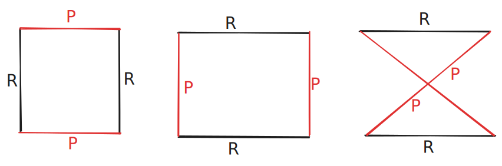
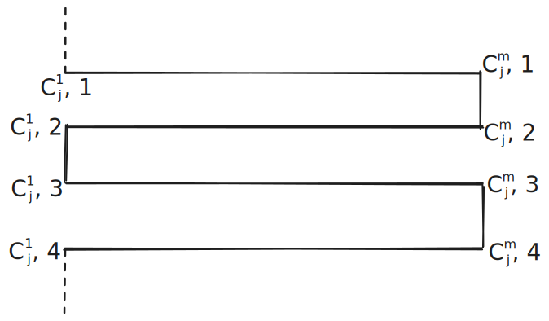
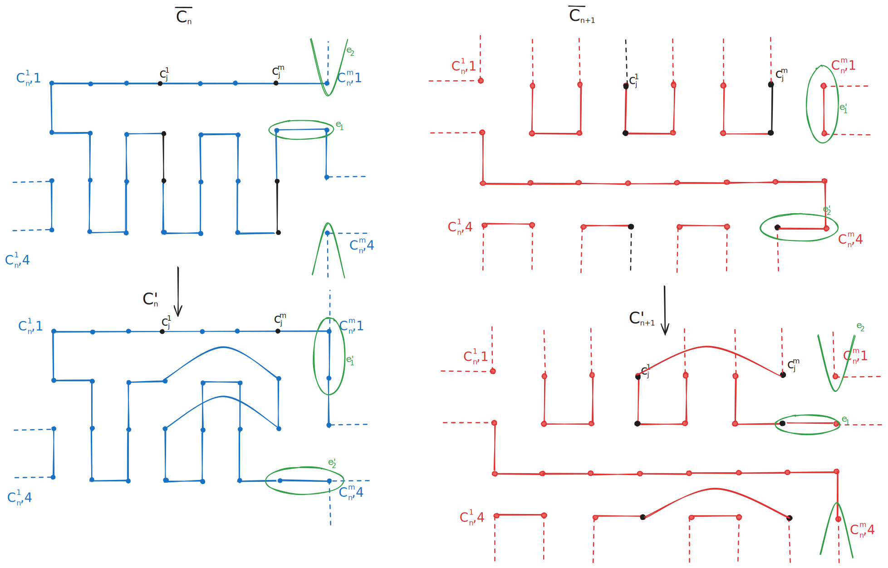
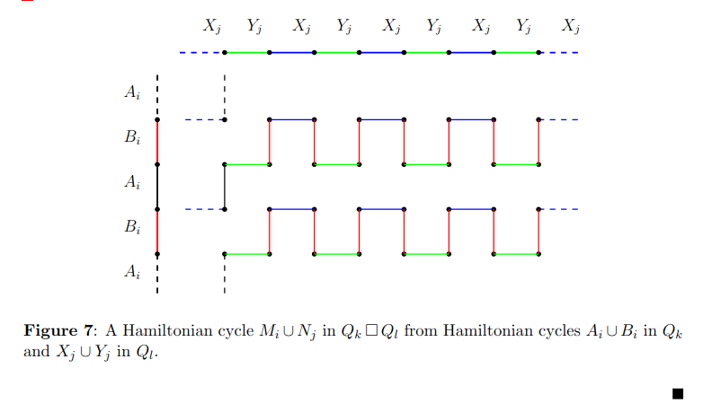

# Permanent
Pro bipartitní graf na $2m$ vrcholech je počet perfektních párování $pm(G)$ přesně permanent jeho biadjacency matice $M_{G} \in \mathbb{Z}_{2}^{m \times m}$, tedy
$$
pm(G) = per(M_{G}) = \sum_{\pi \in S_{n}} \prod_{i=1}^m m_{i,\pi(i)}.
$$
Prvek sumy vyjde 1, právě když $i,\pi(i)$ je hrana, tedy vlastně vybíráme hrany z každého vrcholu z jedné partity.

Dvojitě stochastická matice je taková, že všechny její řádky i sloupce se nasčítají na $1$.

### *Věta 1(van der Waedenova hypotéza):* Pro každou dvojitě stochastickou $m \times m$ matici $M$ platí $per(M) \geq \frac{m!}{m^m}$.

### *Věta 2:* Pro každou binární $m \times m$ matici $M$ se sumou $r_{i}$ v $i$-té řádce pro $1\leq i\leq m$, platí $per(M)\leq \prod_{i=1}^m (r_{i}!)^{1 / r_{i}}$

*Důsledek:* Pro každou $n$-regulární balancovaný bitartitní graf $G$ na $2m$ vrcholech platí
$$
n^m \cdot \frac{m!}{m^m} \leq pm(G) \leq (n!)^{m/n}.
$$
Použijeme-li aproximaci na $m!$ tak máme
$$
pm(G) \geq \left( \frac{n}{m} \right)^m \left( \frac{m}{e} \right)^m = \left( \frac{n}{e} \right)^m.
$$
Pro hyperkrychle můžeme dopočítat
$$
pm(Q_{n}) = \left[ \frac{n}{e} (1+ o(1)) \right]^{2^{n - 1}}.
$$
---
# Maximální forcing number
$f_{\max} (G)$ je maximální $f(M)$ přes všechna perfektní párování $M$ grafu $G$. $f(M)$ je minimální $S \subseteq M$ takové, že $S$ není v jiném párování než v $M$.

#### *Tvrzení:* Pro libovolnou konstantu $0 < c<1$ existuje perfektní párování $M$ v $Q_{n}$, takové že pro dostatečně velké $n$ máme $f(M) \geq c 2^{n-1}$.
*Důkaz:* Pro spor předpokládejme $f_{max}\leq c 2 ^{n-1}$ pak existuje alespoň $pm(Q_{n})$ forcing sets velikosti nejvýše $c2^{n-1}$. Počet takových párování je $2^{2^{n-1}} n^{c2^{n-1}}$, protože
- $2^{2^{n-1}}$ je horní odhad na výběr podmnožin vrcholů,
- $n^{c2^{n-1}}$ je horní odhad výběru hran pro každý výběr podmnožiny vrcholů.

Dohromady aplikujeme-li $pm(G) \geq \left( \frac{n}{e} \right)^m$ tak máme 
$$
\left( \frac{n}{e} \right)^{2^{n-1}} \leq pm(Q_{n}) <  2^{2^{n-1}} n^{c2^{n-1}}.
$$
To nám dává 
$$
\frac{n}{e} < 2 n^c
$$
které je pro dost velké $n$ nepravda.

---
# Finkova věta
$K(Q_{n})$ značí úplná graf na vrcholech $Q_{n}$.
### *Věta 5 (Finkova):* Pro každé perfektní párování $P$ grafu $K(Q_{n})$, kde $n\geq2$ tak existuje perfektní párování $R$ na $Q_{n}$ takové, že $P \cup R$ je Hamiltonovský cyklus na $K(Q_{n})$.
*Důkaz:* Indukce na $n$, pro $n=2$ máme tři možnosti.

Předpokádejme, platnosti tvrzení na $n-1$ a chceme dokázat $n$. Rozdělme $Q_{n}$ dle libovolné $i$ na $Q_{n-1}^{i,0},Q_{n-1}^{i,1}$ na které existují hrany z $P$ (je jich sudě). Nechť $P'$ jsou hrany z $P$ ve směru $i$ a $P_{0} := Q_{n-1}^{i,0} \cap P, P_{1}:= Q_{n-1}^{i,1} \cap P$. 

Nejdříve vezměme $Q_{n-1}^{i,0}$, vybereme libovolné perfektní párování $S_{0}$, které propojuje koncové vrcholy $P'$, pak aplikujeme indukční předpoklad na $P_{0} \cup S_{0}$ a najdeme $R_{0}$ z $Q_{n-1}^{i,0}$ které doplní $P_{0} \cup S_{0} \cup R_{0}$ na Hamiltonovský cyklus. 

Zapomeneme na hrany $S_{0}$ a přesuneme se na $Q_{n-1}^{i,1}$, kde uděláme $S_{1}$ hrany podle vrcholů $P'$ tak aby hrana reprezentovala cestu mezi vrcholy v $Q_{n-1}^{i,0}$ na hranách $P' \cup P_{0} \cup R_{0}$. Pro $P_{1} \cup S_{1}$ aplikujeme indukci a nalezneme $R_{1}$ v $Q_{n-1}^{i,1}$, tak aby $P_{1} \cup S_{1} \cup R_{1}$ udělali Hamiltonovský cyklus. 

Zapomeneme-li teď na hrany $S_{1}$, tak pro $P$ v $K(Q_{n})$ jsme našli hamiltonovský cyklus doplněním hran $R = R_{1} \cup R_{2}$.

### *Věta 6* Nechť $F \subseteq E(Q_{n})$ pro $n\geq 4$ je množina taková, že každá podkrychle dimenze $4$ obsahuje nejvýše jeden vrchol z $F$. Pak každé perfektní párování na $Q_{n} - F$ se může rozšířit na Hamiltonovský cyklus na $Q_{n} -F$.

Pro $n\geq 2$ nechť $M_{n}$ značí graf jehož vrcholy jsou perfektní párování $Q_{n}$ a hrana mezi dvěma vrcholy je pokud jejich sjednocení dává Hamiltonovský cyklus $Q_{n}$.

### *Věta 7:* Pro každé $n \geq{4}$ graf $M_n$ je bipartitní a souvislý.
---
# Rozšiřování na $f$-faktory
$f$-faktor grafu $G$ pro funkci $f:V(G)\to \mathbb{N}$ je spanning podgraf $H$ z $G$ takový, že $\forall v \in V(G) : deg_{H}(v)=f(v)$. Pro množinu $S \subseteq V(G)$ nechť $f(S) = \sum_{v \in S} f(v)$.
### *Věta 8:* Bipartitní graf $G=(A \cup B, E)$ má $f$-faktor $\iff$ $f(A)=f(B)$ a $\forall S \subseteq A: f(S) \leq \sum_{b\in N(S)} \min (f(b), |N_{S}(b)|)$.
Aplikací věty můžeme rozšířit každé párování v $Q_{5}$ rozšířit na $2$-faktor (tedy pokrytí $Q_{n}$ vrcholově disjunktními cykly). To platí také na $n=2,3,4$.

---
# Hamiltonovská dekompozice
*Definice:* **Hamiltonovská dekompozice** $2n$-regulárního grafu je $G$ je rozdělení $E(G)$ na $n$ Hamiltonovských cyklů $G$. 

Ortogonální párování k Hamiltonovské dekompozici $C_{1},\dots,C_{n}$ je $M$, když $\forall i \in [n]:|C_{i} \cap M| =1$.

#### *Lemma 9:* Nechť $G=(V,E)$ je bipartitní graf s párováním $M$ ortogonální k hamiltonovské dekompozici $C_{1},\dots,C_{n}$ grafu $G$. Pak $G \,\square\, C_{4}$ má hamiltonovskou dekompozici také.
*Důkaz:* Nechť $m = |V|$ a předpokládejme $C_{i} = (c_{i}^1,\dots,c_{i}^m)$ s $c_{i}^mc_{i}^1 \in M$ pro všechna $i \in [n]$. Pro $1\leq j\leq n-1$ vytvoříme hamiltonovský cyklus $C'_{j}$ pro $G \,\square\, C_{4}$ pomocí propojení kopií $C_{j}$ a střídání pořadí, tedy
$$
C'_{j}=((C_{j},1),(C_{j}^R,2), (C_{j},3), C_{j}^R,4)).
$$

Protože $c_{j_{1}}^m c_{j_{1}}^1$ a $c_{j_{2}}^m c_{j_{2}}^1$ jsou disjunktní a $C_{j_{1}},C_{j_{2}}$ jsou hranově disjunktní v $G$ tak i všechny $C'_{j_{1}},C'_{j_{2}}$ jsou hranově disjunktní pro různá $1 \leq j_{1},j_{2}\leq n-1$.

Zbývá nám rozdělit $G \,\square\, C_{4} - (\bigcup_{j=1}^{n-1} C'_{j})$ rozdělit na dva hamiltonovské cykly $C'_{n}$ a $C'_{n+1}$ (protože $G \,\square\, C_{4}$ je $(2n+2)$-regulární). Použijeme kopie $C_{n}$ v původním $G$. Zůstal nám podgraf s
- Hrany $(c_{n}^t,k)(c_{n}^{t+1},k)$ pro všechna $t \in [m], k\in \{ 1,2,3,4 \}$,
- hrany $(c_{n}^t,k)(c_{n}^t,k+1)$, které nebyli použity nějakou z $\bigcup_{j=1}^{n-1} C'_{j}$
 
Cykly rozdělíme jako na obrázku:

Definujme cyklus $\overline{C}_n$ tak, že obsahuje tyto hrany:
1. hrany typu $\text{kopie hrany z }G$:
$$
\begin{aligned}
& (c_n^t,1)(c_n^{t+1},1)\ \text{a}\ (c_n^t,3)(c_n^{t+1},3)\quad \text{pro lichá }t, \\
& (c_n^t,2)(c_n^{t+1},2)\ \text{a}\ (c_n^t,4)(c_n^{t+1},4)\quad \text{pro sudá }t;
\end{aligned}
$$

2. hrany typu $\text{hrana v }C_4$:
$$
\begin{aligned}
& (c_n^t,1)(c_n^t,2)\ \text{a}\ (c_n^t,3)(c_n^t,4)\quad \text{pro lichá }t,\\
& (c_n^t,2)(c_n^t,3)\ \text{a}\ (c_n^t,4)(c_n^t,1)\quad \text{pro sudá }t.
\end{aligned}
$$

Cyklus $\overline{C}_{n+1}$ dostaneš přesně „opačnou paritou“, tj. prohodíš role lichých a sudých $t$:
1. hrany typu $\text{kopie hrany z }G$:
$$
\begin{aligned}
& (c_n^t,1)(c_n^{t+1},1)\ \text{a}\ (c_n^t,3)(c_n^{t+1},3)\quad \text{pro sudá }t, \\
& (c_n^t,2)(c_n^{t+1},2)\ \text{a}\ (c_n^t,4)(c_n^{t+1},4)\quad \text{pro lichá }t;
\end{aligned}
$$

2. hrany typu $\text{hrana v }C_4$:
$$
\begin{aligned}
& (c_n^t,1)(c_n^t,2)\ \text{a}\ (c_n^t,3)(c_n^t,4)\quad \text{pro sudá }t,\\
& (c_n^t,2)(c_n^t,3)\ \text{a}\ (c_n^t,4)(c_n^t,1)\quad \text{pro lichá }t.
\end{aligned}
$$

Pro každé $j=1,\dots, n-1$ musíme opravit cykly $\bar{C}_{n},\bar{C}_{n+1}$. Místo $(c^m_{j},1)(c^m_{j},2);(c^1_{j},2)(c^1_{j},3);(c^m_{j},3)(c^m_{j},4), (c^1_{j},4)(c^1_{j},1)$ použité v $C'_{j}$ tak nahradíme pomocí $(c^1_{j},k)(c^m_{j},k)$ pro $k \in \{ 1,2,3,4 \}$.

#### *Důsledek lemma 9:* $Q_{2n}$ má Hamiltonovskou dekompozici pro každé $n\geq 1$.
*Důkaz:* $Q_{2n} \cong C_{4}^n$ a indukcí, protože je to triviální pro $Q_{n}$ máme dle lemma 9 aplikujeme indukci. Potřebujeme ortogonální párování a to existuje protože $4(n-1)<2^{2n}$ pro každé $n\geq{1}$.
### *Věta 11:* ($\stackrel{\leftrightarrow}{Q_{n}}$ znamená orient. graf, kde puvodni hrana je nahrazena 2 orientovanými) $\stackrel{\leftrightarrow}{Q_{n}}$ pro $n \ne 3$ má dekompozici na $n$ orientovaných Hamiltonovských cyklů.

---
# Semi-perfektní $1$-faktorizace
$1$-faktorizace regulárního grafu $G=(V,E)$ je rozdělení $E$ na $1$-faktory (perfektní párování). $1$-faktorizace $F_{1},\dots, F_{n}$ je perfektní, když $F_{i} \cup F_{j}$ indukují hamiltonovské cyckly pro každé různé $1\leq i,j \leq n$. 

### *Hypotéza:* $K_{2n}$ má perfektní $1$-faktorizaci pro všechna $n\geq {2}$.

*Důsledek Věty 11:* Pro $n \ne 3$ existují dvě $1$-faktorizace $\mathcal{A}=A_{1},\dots,A_{n}$ a $\mathcal{B}=B_{1},\dots,B_{n}$ z $Q_{n}$ takové, že $A_{i} \cup B_{i}$ je hamiltonovský cyklus $Q_{n}$ pro každé $1 \leq i \leq n$.

*Důkaz:* Nechť je $H_{1},\dots,H_{n}$ HC dekompozice $\stackrel{\leftrightarrow}{Q_{n}}$ a nechť $A_{i},B_{i}$ jsou dekompozice $H_{i}$, kde $A_{i}$ je s hranami do lichých vrcholů a $B_{i}$ ostatní. Zahodíme-li orientaci hran v $\mathcal{A}, \mathcal{B}$, tak každá hrana $Q_{n}$ je přesně jednou v $\mathcal{A}$ a přesně jednou v $\mathcal{B}$, takže to jsou korektní 1-faktorizace $Q_{n}$.

*Definice:* $1$-faktorizace je $k$-semi-perfektní když $F_{i} \cup F_{j}$ tvoří hamiltonovský cyklus pro všechna $1\leq i \leq k \leq j \leq n$.

### Věta 14: Pro každé $k \ne 3$ a $l \ne 3$ existuje $k$-semi-perfektní faktorizace $Q_{k+l}$.
*Důkaz:* Nechť $Q_{k+l} = Q_{k} \,\square\, Q_{l}$ a
- Nechť $A_{1},\dots,A_{k}$ a $B_{1},\dots,B_{k}$ jsou $1$-faktorizace pro $Q_{k}$,
- $X_{1},\dots,X_{l}$ a $Y_{1},\dots,Y_{l}$ jsou $1$-faktorizace pro $Q_{l}$ jako v Důsledku věty 11.
- Nechť $A_{i}^v,B_{i}^v$ označují kopie $A_{i},B_{i}$ v $v$-tém vlákně $Q_{k}$ (její podkrychli $*^kv$, kde $v\in \{ 0,1 \}^l$) a podobně $X_{i}^u,Y_{i}^u$ pro $u \in \{ 0,1 \}^k$ pro $u*^l$.

Pro $1\leq i\leq k$ definujeme
$$
M_{i} = A_{i}^{0^l} \cup \bigcup_{v\in V(Q_{l}), \, v \ne 0^l} B_{i}^v.
$$
Pro $1\leq j \leq l$ definujeme
$$
N_{j}= \bigcup_{u \in V(Q_{k}), \, u \text{ liché}} X_{j}^u \cup \bigcup_{u \in V(Q_{k}), \, u \text{ sudé}} Y_{j}^u.
$$
$M_{1},\dots,M_{k},N_{1},\dots,N_{l}$ jsou $1$ faktorizace $Q_{k+l}$. Zbývá ukázat, že $M_{i} \cup N_{j}$ je HC pro každé $i\in \{ 1,\dots,k \},j \in \{ 1,\dots,j \}$.

Pro zafixované $i,j$
- Ve vlákně $v$ v $Q_{k}$ procházíme dle $A_{i},B_{i}$ a když bychom měli uzavřít cyklus tak přejdeme po $N_{j}$
- Dle parity $N_{j}$ propojuje vlákna a střídání $X_{j},Y_{j}$ neuzavře cestu nikde lokálně.

Každý vrchol má stupeň $2$ a jednu hranu z $M_{i}$ a druhou z $N_{j}$ a střídáme hrany.
1. Zvolíme start $u_{0},v_{0}$.
	1. pravidlo z $M_i$,
	2. pravidlo z $N_{j}$,
	3. Opakujeme dokud nevidíme opět $u_{0},v_{0}$.

---
Definujme pro graf $G$ s $1$-faktorizací $\mathcal{F}=\{ F_{1},\dots,F_{n} \}$ graf $H(\mathcal{F})$ definovaný na $\mathcal{F}$ s  hranami mezi $F_{i},F_{j}$ pokud tvoří hamiltonovský cyklus. Věta 14 říká, že $Q_{k+l}$ pro $k \ne 3,3 \ne l$ má $1$-faktorizaci $\mathcal{F}$ s $H(\mathcal{F})$ jako $K_{k,l}$.

### Nechť $G$ je bipartitní graf s oběma partitami velikosti $n$, kde $n$ je sudé a $\mathcal{F}$ je $1$-faktorizace. Pak $H(\mathcal{F})$ je bipartitní.
*Důkaz:* Mějme $U,V$ partity $G$. Každá $1$-faktorizace $F_{i}$ idukuje bijekci mezi $U$ a $V$. Pro $F_{i},F_{j}\in \mathcal{F}$ nechť $\pi_{ji}=F^{-1}_{j}F_{i}$ takže je to vlastně permutace na $U$. Zjevně je $\pi_{ii} = id$, $\pi_{ij}=\pi_{ji}^{-1}$ a $\pi_{ij}\pi_{jk}=\pi_{ik}$. 

Když $F_{i}F_{j}\in E(H(\mathcal{F}))$, tak $\pi_{ji}$ je cyklus délky $n$, protože $F_{i},F_{j}$ dělají hamiltonovský cyklus. Je to lichá permutace, protože $n$ je sudé ($sgn(\pi_{ji})=-1$).

Předpokládejme pro spor $H(\mathcal{F})$ obsahující cyklus $F_{i_{1}},\dots,F_{i_{k}}$ liché délky. Pak
$$
1 = sgn(\pi_{i_{1},i_{1}}) = sgn(\pi_{i_{1},i_{k}}\pi_{i_{k},i_{k-}}\dots\pi_{i_{2},i_{1}}) = sgn(\pi_{1}\pi_{k}) \prod^k_{j=2} sgn(\pi_{i_{j},i_{j-1}}) = (-1)^k = -1
$$
a tedy spor.