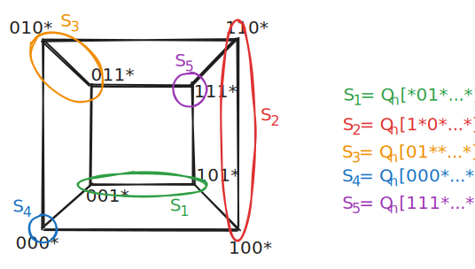
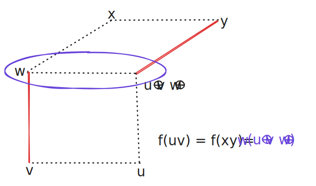

# Spektrum
Direction characteristic (spektrum) párování $M$ v $Q_{n}$ je $\chi(M)=(a_{1},a_{2},\dots,a_{n})$ pro $a_{i}$ jako počet hran ve směru $i$.

Posloupnost $(a_{1},\dots,a_{n})$ nezáporných čísel je **implementovatelná** (perfektním párováním), když $\chi(M)=(a_{1},\dots,a_{n})$ pro nějaké párování $M$ v $Q_{n}$. Tedy zjevně není implementovatelná, když $\sum_{i\in [n]}a_{i}>2^{n-1}$.

### *Věta 1:* Posloupnost $(a_{1},\dots,a_{n})$ s $\sum_{i\in[n]}a_{i}=2^{n-1}$ je implementovatelná právě tehdy, když všechna $a_{i}$ jsou sudá pro všechna $u \in [n]$.
*Důkaz:* ($\implies$) Mějme nějaké $a_{i}$ liché pro nějaké $i \in [n]$ a mějme $M$ perfektní párování implementující $(a_{1},\dots,a_{n})$, pak $Q_{n}^{i,0},Q_{n}^{i,1}$ mají vrcholy nepárované v $M$. Pak tedy $M$ není perfektní párování, což je ve sporu s $|M|=2^{n-1}$.($a_i$ je liché a tedy musí být i půlky liché a nenapárovatelné).

($\impliedby$) Pro $n=2,3,4$ můžeme projít všechny případy. Předpokládejme $a_{1}\leq a_{2} \leq\dots \leq a_{n}$. Rozdělíme $Q_{n}$ do $5$ podkrychlí $S_{1},S_{2},\dots,S_{5}$ dle obrázku

Navíc pro každou $4 \leq i \leq n$ rozdělíme $a_{i}=a_{i}^1 + \dots+a_{i}^5$ ($a_{i}^k$ je příspěvek podkrychle $S_{k}$ ke směru $i$) tak, aby
$$
\begin{align*}
a_{k}+\sum^{n}_{i=4}a_{i}^k &= 2^{n-3} \text{ pro } k=1,2,3 \text{ a} \\
\sum^{n}_{i=4}a_{i}^k &= 2^{n-4} \text{ pro } k=4,5
\end{align*}
$$
Takové rozdělení existuje protože $a_{1},a_{2},a_{3} \leq 2^{n-3}$, jinak by $\sum_{i=3}^n a_{i} \geq (n-2)(2^{n-3}+2) > 2^{n-1}$ pro $n\geq{5}$. Nakonec aplikujeme indukci na $S_{1},\dots,S_{5}$.

### *Věta 2:* Každá posloupnost $(a_{1},a_{2},\dots,a_{n})$ s $\sum_{i\in[n]} a_{i}<2^{n-1}$ je implementovatelná.
---
# Maximální párování
Maximální párování pokud všichni sousedi nespárovaného vrcholu jsou spárované. Nechť $m(G)$ je nejmenší velikost maximálního párování v $G$.

*Pozorování:* V každém maximálním párování v $Q_{n}$ musí aspoň třetina zbývajících hran mít oba vrcholy v párování.

*Důkaz:* Nechť $M$ je maximální párování $Q_{n}$ a $R = E(Q_{n}) \setminus M$. Pro každou hranu $uv\in R$ určíme hranu $f(uv) \in R$ s oběma vrcholy v párování. 
1. Pokud jsou oba v párování, tak $f(uv)=f(uv)$.
2. Předpokládejme, že pro $v$ $\exists w \in V(Q_{n})$ s $vw\in M$, pak $f(uv)=w(u \oplus v \oplus w)$

Pak každá hrana $R$ s oběma vrcholy v spárovanými v $M$ má maximálně 3 hrany k ní přiřazené pomocí $f$ z $R$.

*Důsledek:* 
$$
m(Q_{n}) \geq \frac{n}{3n-1}2^n \quad \text{ pro každé } n\geq1.
$$
*Důkaz:* Nechť je $M$ je maximální párování $Q_{n}$, $m=|M|,m_{1}$ je počet hran s jedním vrcholem spárovaném v $M$ a $m_{2}$ počet hran s oběma vrcholy spárovanými, dle pozorování:
$$
0 \leq 2m_{2} -m_{1} = 3(2m_{2}+m_{1}) - 4(m_{2} +m_{1}).
$$
Spočteme-li incidenci mezi spárovanými vrcholy a hranami $R$ tak máme 
$$
2m_{2} +m_{1} = 2(n-1)m.
$$
Protože $n2^{n-1} = |E(Q_{n})|=m +m_{1}+m_{2}$ tak je jasně vidět
$$
m_{1}+m_{2} = n2^{n-1}-m.
$$
Tedy 
$$
\begin{align}
0 &\leq 3(2m_{2}+m_{1}) - 4(m_{2} +m_{1}) \\
0&\leq 3[2(n-1)m] - 4(n2^{n-1} -m) \\
-6(n-1)m &\leq -n2^{n+1}  +4m  \\
(6n -6 +4) m &\geq n2^{n+1} \\
m &\geq \frac{n}{3n-1}2^{n}
\end{align}
$$
#### *Lemma 5:* $\forall n\geq {1}:m(Q_{n+1})\leq 2m(Q_{n})$.
*Důkaz:* Rozdělme $Q_{n+1}$ dle $n+1$ na $Q^0_{n+1},Q^1_{n+1}$. Nechť $M_{0}$ je maximální párování v $Q^0_{n+1}$. Pak $M_{1}=M_{0} \oplus e_{1} \oplus e_{n+1}$ je maximální párování v $Q^1_{n+1}$. 

Každý vrchol $v$ ve $Q^0_{n+1}$, který je nespárovaný v $M_{0}$ má svého $x=v \oplus e_{1}$ souseda pokrytého pomocí $M_{0}$, protože je $M_0$ maximální. Ale pak $v \oplus e_{n+1} = x \oplus e_{1} \oplus e_{n +1}$ je spárovaný pomocí $M_{1}$. Tedy párování $M_{0} \cup M_{1}$ je maximální párování v $Q_{n+1}$ velikosti $2|M_{0}|$,

Dle *Lemma 5* je posloupnost $m(Q_{n})/2^n$ nerostoucí a s limitou. Dle Důsledku je její limita alespoň $1/3$.

### *Věta 6:* $\lim_{ n \to \infty } m(Q_{n})/2^n = 1 / 3$.
*Důkaz:* Předpokládejme $6 \mid n$. Nechť $L_{0} \cup L_{1} \cup\dots \cup L_{n}$ je rozdělení $V(Q_{n})$ na úrovně a pro $k=0,1,2$ nechť 
$$
C_{k} = \bigcup_{i \equiv k \mod 3,\, i\leq n/ 2} (L_{i} \cup L_{n-i}).
$$
Když $S \subseteq L_{i}$ s $i<n / 2$, pak $|N(S) \cap L_{i+1}|\geq|S|\frac{n-1}{i+1}$ (vrchol v $S$ má $n-1$ hran v $L_{i+1}$ a $L_{i+1}$ má $i+1$ sousedů na $L_{i}$). Tedy dle Hallovy věty

>*Hallova věta:* Pro množinu $S=\{ S_{1},S_{2},\dots \}$ existuje systém různých reprezentantů $X=\{ x_{1},x_{2},\dots \}$ právě když $S$ pro každou její podmnožinu platí, že libovolných $n$ množin má alespoň $n$ různých prvků.

existuje párování $M_{1} \subseteq E(C_{1},C_{2})$, které je maximální v $C_{1} \cup C_{2}$ (pokrývá $C_1$) podobně existuje $M_{2} \subseteq E(C_{2},C_{0})$ pokrývající zbylé vrcholy $C_{2}$ (až na pár vrcholů na $n / 2 -1, n/ 2 +1$ úrovních). Pozorujme, že párování $M_{1} \cup M_{2}$ je maximální, navíc
$$
|M_{1} \cup M_{2}| \leq 2 \cdot \sum_{i \equiv k \mod 3,\, i\leq n/2} \binom{n}{i} = m.
$$
- $M_{1}$ páruje každý vrchol z $C_1$ s nějakým v $C_{2}$, tedy $|M_{1}|=|C_{2}|$.
- $M_{2}$ páruje část $C_{2}$ s $C_{0}$, takže $|M_{2}| \leq C_{2}$.
- Takže $|M_{1}| + |M_{2}| \leq |C_{1}|+|C_{2}|$.

Haldiny kolem středu jsou jako $Bin(n,1 /2)$ a zbytky modulo $3$ jsou asymptoticky rovnoměrné, takže každá třída dostane zhruba $\frac{1}{3}$ vrcholů, az vrstvy uprostřed, kde je ale $\binom{n}{n / 2 \pm{1}}$ vrcholů, které jsou podílu $o(2^n)$ (konkrétně $2^n / \sqrt{ n } \in o(2^n)$), takže
$$
m = 2^n\left( \frac{1}{3} + o(1) \right).
$$
takže
$$ 
\limsup_{ n \to \infty } m(Q_{n})/2^n \leq 1 / 3.
$$
---
# Forcing number
Mějme $M \subseteq E(G)$ perfektní párování. Množina $S \subseteq M$ vynucuje $M$ když $S$ není v žádném jiném perfektním párování než v $M$. $f(M)$ je forcing number $M$, které označuje minimální velikost vynucující množiny $S \subseteq M$. Nechť $f_{\min}$ je nejmenší forcing number všech perfektních párování $G$.

*Pozorování 1:* Pro každou $S \subseteq E(G)$, která vynucuje perfektní párování tak indukovaný podgraf $G \setminus V(S)$ má unikátní perfektní párování.

Z horní hranice počtu vrcholů v takovém indukovaném podgrafu můžeme získat dolní hranici na $|S|$ a tedy i $f_{\min}(G)$.

---
# Spodní hranice $f_{\min}(G)$
Odteď mějme $G = (U \cup V, E)$ neorientovaný bipartitní graf s partitami $U=\{ u_{1},\dots,u_{|U|} \}$ a $V= \{ v_{1},\dots,v_{|V|} \}$. Biadjacency matrix $G$ je matice $B= (b_{ij})^{|U|\times|V|}$ nad $\mathbb{N}_{0}$, kde 
$$
b_{ij} = \begin{cases}
1 &\text{ pro } u_{i}v_{j}\in E, \\
0 &\text{ jinak}.
\end{cases}
$$
Nechť $\mathbb{F}$ je libovolné těleso a libovolně určeme nenulové váhy $w_{ij} \in \mathbb{F}$ hranám $u_{i}v_{j}\in E.$ Vážená biadjacency matrix $G$ je matice $W=(w'_{ij})^{|U|\times|V|}$, kde 
$$
w'_{ij} = \begin{cases}
w_{ij} &\text{ pro } u_{i}v_{j}\in E, \\
0 &\text{ jinak}.
\end{cases}
$$
#### *Lemma 8:* Nechť $H$ je indukovaný podgraf bipartitního $G$ s unikátním perfektním párováním, nechť $W$ je vážená biadjacency matice $G$ s hodnotami z tělesa $\mathbb{F}$. Pak $|H|\leq 2 rank(W)$, kde $|H|$ je počet vrcholů.
*Důkaz:* Protože $H$ má perfektní párování, tak obě jeho partity mají stejnou velikost. Nechť $W_{H}$ je podmatice $W$ indukované na $H$. Když $W_{H}$ je čtvercová matice velikost $|H| / 2$ a má nenulový determinant, protože $H$ má unikátní perfektní párování, takže její $rank(W_{H}) = |H| / 2$, tak
$$
|H| = 2rank(W_{H}) \leq 2rank(W).
$$
Ve $Q_{n}$ vypadá biadjacency matice $M_{n}$ následovně:
$$
M_{1} = (1), \quad M_{n} = \begin{pmatrix}
M_{n-1} & I \\
I & M_{n-1}
\end{pmatrix}
$$
Platí, že je $M_{n}$ regulární jen pro lichá $n$.

#### *Lemma 9:* Pro každé $n\geq 1$ máme regulární matici $A_{n}$ nad $\mathbb{Z}_{3}$, takovou, že $A_{n},A_{n}^{-1}$ jsou vážené biadjacency matice $Q_{n}$.
*Důkaz:* Nechť $A_{1} =A_{1}^{-1} = (1)$. Pro $n\geq{1}$ předpokládejme regularitu $A_{n}$ a ukážeme regularitu $A_{n+1}$, mějme
$$
A_{n+1} = \begin{pmatrix}
2A_{n} & I \\
I & A_{n}^{-1}
\end{pmatrix}
$$
V $\mathbb{Z}_{3}$ máme $2+2 = 2\cdot 2 = 1, 1+2 =0$, takže 
$$
A_{n+1}^{-1} = \begin{pmatrix}
A_{n}^{-1} & 2I \\
2I & 2A_{n}
\end{pmatrix}
$$
pak
$$
A_{n+1} A^{-1}_{n+1}=\begin{pmatrix}
2A_{n} & I \\
I & A_{n}^{-1}
\end{pmatrix} \begin{pmatrix}
A_{n}^{-1} & 2I \\
2I & 2A_{n}
\end{pmatrix} = \begin{pmatrix}
2A_{n} A_{n}^{-1} + I \cdot 2I & 4A_{n} + 2A_{n} \\
A^{-1}_{n} + 2A^{-1}_{n} & 2I + 2 A_{n} A_{n}^{-1}
\end{pmatrix}= I
$$
Tedy je regulární i $A_{n+1}$, protože má inverzi.

### *Věta 10:* Každý indukovaný podgraf $H$ z $Q_{n}, n\geq{2}$, s unikátním perfektním párováním má maximálně $2^{n -1}$ vrcholů.
*Důkaz:* Nechť $A_{n-1}$ je matice jako v předešlém Lemma, tedy vzhledem k regularitě, tak má $rank(A_{n -1)} = 2^{n-2}$. Nechť 
$$
B_{n} = \begin{pmatrix}
A_{n-1}  & I \\
I & A^{-1}_{n-1}
\end{pmatrix}
$$
pak $2^{n-2}\leq rank(B_{n}) \leq 2^{n-1}$. Navíc pro všechny vektory $x \in \mathbb{Z}_{3}^{2^{n-2}}$ dostáváme
$$
B_{n} \begin{pmatrix}
x  \\
2A_{n-1} x
\end{pmatrix} = \begin{pmatrix}
A_{n-1}x +I(2A_{n-1} x)  \\
Ix + A^{-1}_{n-1}(2 A_{n-1}x)
\end{pmatrix} = \begin{pmatrix}
3A_{n-1} \\
3x
\end{pmatrix} = 0
$$
Takže $B_{n}$ má nejvýše $2^{n-2}$ lineárně nezávislých sloupců. Tedy $rank(B_{n}) = 2^{n-2}$ a z [Lemma 8](#*Lemma%208%20*%20Nechť%20$H$%20je%20indukovaný%20podgraf%20bipartitního%20$G$%20s%20unikátním%20perfektním%20párováním,%20nechť%20$W$%20je%20vážená%20biadjacency%20matice%20$G$%20s%20hodnotami%20z%20tělesa%20$%20mathbb{F}$.%20Pak%20$%20H%20leq%202%20rank(W)$,%20kde%20$%20H%20$%20je%20počet%20vrcholů.) máme $|H| \leq 2^{n-1}$.

*Důsledek:* $\forall n\geq 2, f_{\min}(Q_{n}) = 2^{n-2}$.

*Důkaz:* Nechť $S$ je minimální vynucující množina perfektního párování $M$ na $Q_{n}$. Pak dle *Pozorování 1* a věty 10 máme $|Q_{n} \setminus V(S)| \leq 2^{n-1}$, takže $|S| \geq 2^{n-2}$. Na druhou stranu perfektní párování $M = \{ uv \mid u \oplus v = e_{1} \}$ je vynuceno množinou $S = \{ uv \in M \mid u_{1} = 0 \text{ a } |u| \text{ je sudé} \}$, která má velikost $2^{n-2}$.

---
# Semi-indukovaná párování
Párování $M$ v $G$ je indukované, když je indukované svými vrcholy (indukovaný podgraf $G$) tedy žádné hrany $M$ nemají průnik. Tedy oba vrcholy každé hrany z $M$ nemají pokrytého v $M$ žádného ze sousedů. Párování je **semi-indukované** pokud každá hrana z $M$ má aspoň jeden vrchol bez vrcholů v sousedství v $M$.

*Důsledek:* Maximální velikost semi-indukovaného párování v $Q_{n},n\geq 2$ je $2^{n-2}$.

*Důkaz:* Pokud je $M$ semi-indukované, tak podgraf indukovaný z $V(M)$ má unikátní párování a tedy dle Věty 10 $|V(M)| \leq 2^{n-1}$ a $|M|\leq 2^{n-2}$. Na druhou stranu v důkazu důsledku Věty 10 (o $\forall n\geq 2: f_{\min}(Q_{n})=2^{n-2}$) jsme našli indukované (zároveň i semi-indukované) párování velikosti $2^{n-2}$.