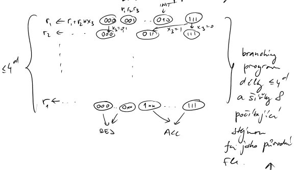

# Branching programs a NC1

## Branching programy OBDD
Alternativní názvy:
- ordered binary decision diagrams,
- switching and rectifier networks.

Branching program je orientovaný acyklický graf:
- jeden zdrojový uzel `Init`,
- dva cílové uzly `ACCEPT`, `REJECT`,
- každý vnitřní vrchol je označen proměnnou,
- z každého vnitřního vrcholu vedou dvě hrany označené $0$ a $1$.

Výpočet branching programu:
- začíná ve vrcholu `Init`,
- čte hodnotu proměnné přiřazené aktuálnímu vrcholu,
- následuje hranu konzistentní s hodnotou této proměnné,
- skončí v `ACCEPT` nebo `REJECT`,
- výsledek je cílový vrchol.

Zajímá nás:
- **velikost** branching programu = počet vrcholů,
- **délka** branching programu = nejdelší cesta v programu,
- **šířka** branching programu = maximální velikost vrstvy.

Hrany pouze mezi sousedními vrstvami.
Příklady:
1. Parita $x_1 \oplus x_2 \oplus \cdots \oplus x_n$ lze spočítat branching programem velikosti $2n+O(1)$, šířky $2$ a délky $n$. TODO: obrázek
2. Součet modulo $p$ $\sum_i x_i \bmod p$ má branching program velikosti $pn+O(p)$, šířky $p$, délky $n$.
3. Majorita/`MAJ` má branching program, velikost a šířka podle počtu možných hodnot počitadla.

Kombinování branching programů:
- pro $f\wedge g$ se spojí přijímající větev programu pro $f$ s programem pro $g$,
- pro $f\vee g$ obdobně.

Z toho:
- $AC^0$ má branching programy polynomiální velikosti a konstantní šířky,
- $ACC^0$ se řeší pomocí hradel modulo.
## Věta: $L/poly$ a branching programy
Věta v poznámkách:
$$
f\in L/poly \iff f \text{ je počitatelná branching programy polynomiální velikosti.}
$$
Poznámka: $L / poly$ je log-space výpočet s polynomiální radící funkcí $g$.

Na vstupu $x,g(|x|)$ je konfigurace log-space stroje reprezentována vrcholem branching programu. Přechody stroje určují hrany programu.

## NC1
$NC^1$ jsou obvody hloubky $O(\log n)$ sestávající z binárních hradel $\vee,\wedge,\neg$.
### Příklad: binární sčítání
Mějme $x,y\in\{0,1\}^{n}$. Pro přenos $c_{ij}$, zda $j$-tá pozice generuje carry, která probublá až na $i$-tou pozici:
$$
c_{ij} = (x_j \wedge y_j) \wedge \bigwedge_{\ell=i}^{j-1}(x_
\ell \vee y_\ell).
$$
Potom:
$$
c_i = \bigvee_{j=i+1}^{n} c_{ij},
$$
$$
z_i = x_i \oplus y_i \oplus c_i, \text{ pro } i=1,\dots,n
$$
$$
z_0=c_0.
$$
Tedy sčítání dvou čísel je v $AC^0 \implies NC^1$.
### Součet více čísel
Pro součet tří čísel lze zkonstruovat součet dvou čísel pomocí carry-save principu:
$$
e_i = a_i \oplus b_i \oplus c_i,
$$
$$
f_{i-1} = [a_i+b_i+c_i \geq 2].
$$
Suma tří čísel se převádí na sumu dvou čísel. Rekurzivní součet $n$ čísel dává hloubku přibližně $\frac23 n \to (\frac23)^i n \to 2$ čísel.

Z toho plyne sčítání více čísel v $NC^1$.

Další příklady:
3. $x\cdot y \in NC^1$.
4. `MAJ` je v $NC^1$.
## Barringtonova věta
Věta (Barrington, Ben-Or, Cleve): Formuli hloubky $d$ nad oborem $R$ s proměnnými $x_1,\dots,x_n$ lze vyhodnotit registrovým programem délky $\leq 4^d$ se třemi registry nad $R$.

Tím se ukazuje souvislost $NC^1$ a branching programů konstantní šířky.
## Okruhy a formule
Okruh nad strukturou $(R,+,\cdot)$ nemusí být multiplikativní grupa. Příklady struktur:
$$
\mathbb{C},\; \mathbb{R},\; \mathbb{Z},\; \mathbb{Z}_n,\; GF[p].
$$
Formule nad $R(+ ,\cdot)$ je strom výpočtu s operacemi $+$ a $\cdot$.
## Registrový model
Registry:
- $r_1,\dots,r_k$ jsou pracovní registry, a
- $x_1,\dots,x_n$ jsou vstupní registry. 
- Hodnoty jsou z $R$.

Program je posloupnost instrukcí typu:
- $r_i \leftarrow r_j \pm r_k$,
- $r_i \leftarrow r_j \cdot r_k$.
- Registry $r_i,r_j,r_k$ mohou být i vstupní registry $x_j,x_k$.

Příklad programu:
1. $r_1 \leftarrow x_{13}-x_2$,
2. $r_2 \leftarrow x_4+x_2$,
3. $r_3 \leftarrow x_1\cdot x_4$,
4. $r_4 \leftarrow x_{12}-x_3$,
5. $r_5 \leftarrow r_1\cdot r_2$,
6. $r_5 \leftarrow r_5-r_4$.

Počítá
$$
r_{5} = x_{13}x_{4} +x_{13}x_{2}-x_{2}x_{4}-x_{2}^2 -x_{12} + x_{3}.
$$
Kolik registrů potřebujeme na vyhodnocení výrazu?
1. nejvýše velikost formule,
2. nejvýše hloubka formule $\leq 1$ navíc,
3. ve skutečnosti stačí $3$ nebo $4$.

## Ben-Or a Cleve
Věta: Formuli hloubky $d$ nad okruhem $R$ s proměnnými lze vyhodnotit registrovým programem délky $\leq 4^d$ se třemi registry nad $R$.

Důkazová idea:

Překládáme instrukce
$$
r_i \leftarrow r_i \pm r_jx_k, \qquad i\ne j
$$
nebo
$$
r_i \leftarrow r_i \pm x_k.
$$
Pro výpočet je potřeba registr navíc pro simulaci těchto instrukcí povolenými instrukcemi.

Cíl pro formuli $f(x_1,\dots,x_n)$: chceme zkonstruovat program ekvivalentní transformacím
$$
r_1 \leftarrow r_1 + r_2 f(x_1,
\dots,x_n)
$$
nebo
$$
r_1 \leftarrow r_1 - r_2 f(x_1,
\dots,x_n),
$$
zachovávající hodnotu na $r_2,r_{3}$, kde na počátku nastavíme $r_1=0$ a $r_2=1$, takže na konci máme
$$
r_1=f(x_1,
\dots,x_n).
$$
Konstrukční kroky, vlastně indukce (předpokládáme, že $h,g,f$ jsou vyhodnotitelné na 3 registrech):
1. Pro proměnnou
$$
f(x_1,
\dots,x_n)=x_i
$$
stačí přímá instrukce
$$
r_1 \leftarrow r_1+r_2x_i.
$$
2. Pro součet
$$
f=g+h
$$
spustíme program pro $g$ a potom program pro $h$:
$$
r_1 \leftarrow r_1+r_2g(x),
$$
$$
r_1 \leftarrow r_1+r_2h(x).
$$
Tím se efekty sečtou.
3. Pro součin
$$
f=g\cdot h
$$
použijeme pomocný registr $r_3$ a programy pro $g,h$:
$$
\begin{align*}
r_3 &\leftarrow r_3+r_2g(x), \\
r_1 &\leftarrow r_1+r_3h(x),\\
r_3 &\leftarrow r_3-r_2g(x), \\
 r_{3}&\text{ mohl být libovolný} \\
r_1 &\leftarrow r_1-r_3h(x). 
\end{align*}
$$
Požadovaný efekt je zachován. Délka programu je
$$
\leq 4^d
$$
a stačí $3$ ($4$) registry.
## Barringtonova věta
Okruh $GF[2]=(\{0,1\},\oplus,\cdot)$ je těleso. Platí:
- negace lze vyjádřit jako $1\oplus x$,
- AND je součin,
- OR lze vyjádřit polynomem:
$$
x\vee y = x+y+xy \quad \text{nad } GF[2].
$$
Booleovská formule se skládá z $\wedge,\vee,\neg$, ale lze ji přepsat jako aritmetickou formuli nad $GF[2]$. Hloubka se zvětší nejvýše třikrát.

Pro danou funkci nad $GF[2]$ hloubky $d$ můžeme sestrojit registrový program se třemi registry, každý z nich pracuje s jedním bitem. Konfigurace registrů má $2^3=8$ možností.

Z toho dostaneme branching program délky $\leq 4^{3d}$ a šířky $8$, který počítá stejnou funkci.

Věta (Barrington 1987): Pokud je $f_n$ počitatelná booleovskou formulí hloubky $d$, lze ji počítat také branching programem délky $\leq 4^d$ a šířky $5$.

Konstrukce dává i mírně slabší/obdobný výsledek délky $\leq 4^{3d}$ a šířky $8$.

---
## Vynucení a náhodné vyhodnocení

Technika Ben-Or & Cleve dovoluje vyhodnocovat matice
$$
A_1,A_2,
\dots,A_n
$$
nad $GF[2]$ velikosti $n\times n$, s použitím $O(\log n)$ bitů prostoru a $\tilde O(n^2)$ prostoru `[sporné čtení]` na kombinaci matice. Simulují se tři registry $r_1,r_2,r_3$.

Instrukce typu
$$
r_i \leftarrow r_i+r_jx_k
$$
lze chápat jako inserci. Programy lze zinvertovat:
$$
P \to P^{-1}.
$$
