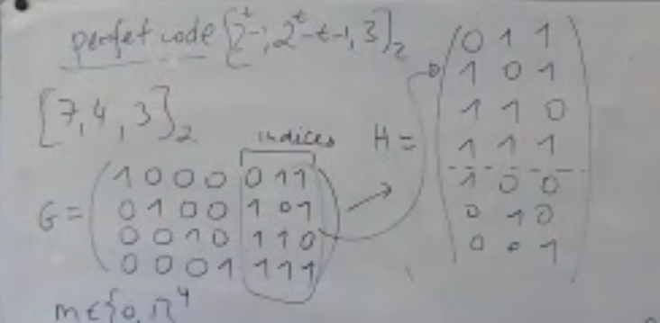

## Hammingův kód
$k= 2^\ell - \ell -1, n=2^\ell -1$ a pak $(2^\ell -1,2^\ell-\ell -1, 3)$ pro konstrukci mějme $k$ $\ell$-bitových vektorů s alespoň $2$ jedničkami a $p_{i} := \sum_{i\text{-tý}} x_{j}$ bit $j$-tého vektoru je $1$. (Odpovídá to výběru podmnožin a parit na nich s alespoň dvěma prvky, proto jsou zakázané $\ell$ pro jednobitové vektory a 0 vektor)

$d$ Je $3$ protože umíme opravit jednu chybu: mějme $x_{1}\dots x_{k}p_i \dots p_{\ell}$ a chyby jsou na dvou možných místech
- v části $x_{1},\dots,x_{k}\implies$ aspoň 2 paritní bity jsou špatně.
- v části $p_{1}\dots p_{\ell}$ nesedí jeden paritní bit.

a dekódujeme dle přepočtu $p_{i}$ a v tabulce vektoru určujících podmnožiny se podíváme se, který bit nesedí.

---
*Definice:* Lineární kód je dán maticí $G$ rozměrů $k \times n$, kde pro zprávu $m\in \{ 0,1 \}^k$ dostáváme kódové slovo $y$ pomocí
$$
mG = y, \quad mG = C_{G}(m).
$$

Kontrolní matice $H \in \{ 0,1 \}^{n \times (n- k)}$, tedy
$$
y\in \{ 0,1 \}^n: y\in C \iff yH = 0^{n-k}.
$$

Zápis lineárního kódu je $[n,k,d]_{q}$ na rozdíl od $(n,k,d)$.

---
### $\forall G$ generující matice $\exists$ kontrolní matice $H$
*Důkaz:* $H$ je báze ortogonálního doplňku $\{ y \mid y=xG \}= C$. Tedy chceme řešit systém rovnic $Gz^t = 0^{n-k}$.

---
Mějme $[n,k,d]_{q}$ a vezmeme-li kódová slova, tak platí
$$
\forall x,y\in C: x+y \in C; x-y \in C; \quad \forall \alpha\in GF[q]: \alpha x\in C.
$$
Pozorujme
$$
d_{Ham} (x,y)= |\{ i, x_{i} \ne y_{i} \}| = |\{ i, (x-y)_{i}\ne 0 \}| = wt_{Ham} (x-y).
$$
A tedy zajímá-li nás $d(C)=\min_{x\ne y\in C} d_{Ham}(x,y)$ a to je dle pozorování stejné jako 
$$
\min_{x\ne y\in C} wt_{Ham}(x-y) = \min_{z\in C; z\ne 0} wt_{Ham}(z).
$$
---
*Syndrom* je $eH$ u dekódování $y'H= (y+e)H=yH + eH=eH$, kde můžeme mít pak look-up tabulku a dekódovat co dělá tento error.

---
### *Věta (Singelton):* $\forall$ kód $C$, $[n,k,d]_{q}$, kde $n\geq k+d-1$.
*Důkaz:* 

---
# Náhodný lineární kód
Mějme náhodnou $G \in \{ 0,1 \}^{k \times n}$.

### *Tvrzení:* Pokud $d;2^k< \frac{2^n}{\text{Vol}_{2}(n,d)} \cdot \frac{1}{2}$, pak $G$ generuje s velkou pravděpodobností ($p\in(0, 1/2), d=pn$) $[n,k,d]_{2}$ kód.
*Důkaz:* TODO:

---
# Hammingova mez
$[n,k,pn]_{2}$ kód má $k< \left( 1-H\left( \frac{p}{2} \right) \right)n (+\log n)$. Protože $\text{Vol}_{2}\left( n, \frac{pn}{2} \right) \ge \frac{2^{H(p/2)n}}{(n+1)}$ a tedy
$$
2^k \leq \frac{2^n \cdot n}{2^{H(p/2)n}}
$$
$$
k\leq \left( 1-H\left(  \frac{p}{2}  \right) \right)n + \log n
$$