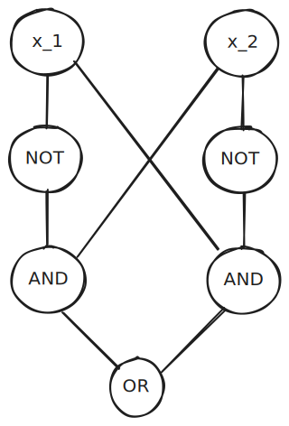

Neuniformita je pro každou délku vstupu existuje individuální výpočetní zařízení, které vstupy dané délky vyhodnocují.

*Definice:* **Booleovský obvod** se $n$ vstupy a jedním výstupem je orientovaný graf s $n$ zdrojovými vrcholy ($deg_{in} = 0$) a jedním stokem. 
- Zdrojové vrcholy jsou jsou vstupy, ostatní vrcholy jsou hradla.
- Hradla $AND,OR$ se vstupním stupněm $2$ a $NOT$ s jedním vstupem.
- Velikost obvodu = počet vrcholů

*Značení:* Pro obvod $C$ a vstup $x$ značíme $C(x)$ hodnotu ve výstupním vrcholu.

---
## Příklady

---
$(x_{1} \lor x_{2} \lor x_3) \land (x_{1} \lor x_{2} \lor x_{4}) \land (x_{1} \lor x_{2} \lor x_{5})$ TODO: obrázek stromu i DAGu

---
## Pozorování
Pokud se využije faktu, že výstupní stupeň hradel není omezen, tak můžeme konstruovat menší obvody ve formě DAG-u.
1. Při změně vstupní arity $AND,OR$ ze $2$ na $n$ (nebo $p(n)$) na velikost změní o faktor $n$ ($p(n)$) a hloubku o $O(\log n)$
2. Při změně u výstupní arity hradel z $1$ na $2$ může dojít k exponenciálnímu rozdílu ve velikosti obvodu. 

---
*Definice:* Nechť $T : \mathbb{N}\rightarrow \mathbb{N}$ je funkce, rodina obvodů velikosti $T(n)$ je posloupnost obvodů $\{ C_{n} \}_{n\in \mathbb{N}}$, kde $\forall n: C_{n}$ má $n$ vstupů a $|C_{n}|\leq T(n)$.
- Jazyk patří do třídy $SIZE(T(n))$, pokud $\exists$ rodina obvodů $\{ C_{n} \}$ velikosti $T(n)$ taková, že $\forall x\in \{ 0,1 \}^n: x\in L \iff C_{n}(x)=1$. 

*Definice:* $\mathcal{P}/\text{poly}$ je třída jazyků, přijímaných rodinami obvodů polynomiální velikosti, tedy
$$
\mathcal{P}/\text{poly} = \bigcup_{c=0}^\infty SIZE (n^c).
$$
---
### *Věta:* $\mathcal{P} \subseteq\mathcal{P}/\text{poly}$.
$\supseteq$ nemůže platit, protože umíme zakódovat halting problém.
$$
L = \{  n \mid n \text{ kóduje dvojici } M,x \text{ pro DTS a vstup, zda přijímá stroj vstup} \}
$$

*Důkaz:* $L\in \mathcal{P}\implies \exists M$ DTS takový, že $L=L(M)$ a $M$ pracuje v čase $p(n)$, kde $p$ je jazykem. A tedy i existuje oblivious DTS $\hat{M}$ rozpoznávající $L$ a pracující v $p^2(n)$. 

Oblivious je, že pozice hlav nezáleží na vstupu, ale pouze na počtu kroků od začátku výpočtu.

*Myšlenka konstrukce obvodu:* 
- Nechť je na vstupu $\hat{M}$ řetězec $x$ délky $n$. 
- Označme $z_{1},z_{2},\dots,z_{T(n)}$ pro displeje $\hat{M}$ během výpočtu stroje $\hat{M}$. 
- $C_{v}$ je obvod odpovídající poslednímu kroku, kdy byla vstupní hlava na stejné pozici jako po kroku $i\hbox{.}$ 
- Pokud $C_v$ není definováno dostane $C_{i}$ příslušný bit ze vstupu. 
- Obvod přijme vstup $x$, pokud $z_{T(n)}$ kóduje přijímající stav.

Každé $C_{i}$ má konstantní velikost a tím pádem máme $O(T(n))$ jako celkovou velikost.

*Důsledek:* $\exists$ DTS $\tilde{M}$, který na $1^n$ vydá na výstupu popis obvodu $C_{n}$ a navíc:
1. $\tilde{M}$ pracuje v polynomiálním čase,
2. $\LARGE\tilde{M}$ pracuje v logaritmickém prostoru.
- popis $C_{n}$ dává na výstupní pásku (mimo počítaný prostor)
- vše co se týká popisu $\hat{M}$ je konstantní
- je třeba si pamatovat kódy pozic vstupní a pracovní hlavy, ale na ty je třeba $\log n$ a $\log T(n) = O(\log n)$ bitů a ještě counter na který krok $\hat{M}$ právě řeší (konstruuje příslušné $C_{i}$)

---
# Uniformní rodiny obvodů
## $\mathcal{P}$-uniformita
*Definice:* Rodina obvodů $\{ C_{n} \}_{n\in \mathbb{N}}$ je $\mathcal{P}$-uniformní pokud $\exists$ DTS, který na vstupu $1^n$ vydá v poly-čase popis obvodu $C_{n}$.

### *Věta:* $L$ je přijímán $\mathcal{P}$-uniformní rodinou obvodů $\iff L\in \mathcal{P}$.
*Důkaz:* ($\implies$) DTS $M$ pracuje pro rozpoznání $L$ v poly-čase následovně (vstupem je $x$ s $|x|=n$):
1. Simuluji DTS $\hat{M}$ zajišťující, že $L$ je $\mathcal{P}$-uniformní rodina obvodů a ten vygeneruje popis $C_{n}$.
2. $M$ simuluje práci $C_{n}$ na vstupu $x$.

($\impliedby$) je implikováno díky důkazu [*Věta:* $\mathcal{P} \subseteq\mathcal{P}/\text{poly}$.](#*Věta%20*%20$%20mathcal{P}%20subseteq%20mathcal{P}/%20text{poly}$.)  

---
## $LOG-SPACE$-uniformita
*Definice:* Rodina obvodů $\{ C_{n} \}_{n\in \mathbb{N}}$ je $LOG-SPACE$-uniformní, pokud $\exists$ DTS, který na vstupu $1^n$ vydá popis obvodu $C_{n}$ a přitom použije na svých pracovních páská prostor $O(\log n)$.

### *Věta:* $L$ je přijímán $LOG-SPACE$-uniformní rodinou obvodů $\iff L\in \mathcal{P}$.
*Důkaz:* ($\implies$) stačí stejný důkaz jako u $\mathcal{P}$-uniformity, když víme, že $\hat{M}$ pracující v $O(\log n)$ prostoru pracuje v poly-čase (dle počtu konfigurací).

($\impliedby$) je díky důsledku 2. pro [*Věta:* $\mathcal{P} \subseteq\mathcal{P}/\text{poly}$.](#*Věta%20*%20$%20mathcal{P}%20subseteq%20mathcal{P}/%20text{poly}$.) 

---
## $\mathcal{P}$-úplný jazyk
*Definice:* Jazyk $CIRCUIT-EVAL$ je jazykem dvojic $(C,x)$, kde $C$ je popis $n$-vstupového obvodu a $x\in \{ 0,1 \}^n$ takových, že $C(x)=1$.

*Definice:* $\mathcal{P}$ těžký jazyk je takový, že existuje DTS pracující v $LOG-SPACE$ převádějící všechny jazyky z $\mathcal{P}$ na tento.

### *Věta:* $CIRCUIT-EVAL$ je $\mathcal{P}$-úplný.
*Důkaz:* Nechť $L\in \mathcal{P}$ libovolný (uvažujme zakódování a nad abecedou $\{ 0,1 \}$), pak z důsledku věty [*Věta:* $\mathcal{P} \subseteq\mathcal{P}/\text{poly}$.](#*Věta%20*%20$%20mathcal{P}%20subseteq%20mathcal{P}/%20text{poly}$.) máme, že $\exists\, LOG-SPACE$ DTS transducer, který převádí $L$ na $CIRCUIT-EVAL$. 

---
## Alternativní důkaz Cook-Levinovy věty
*Definice:* $CKT-SAT$ sestává z řetězců kódujících Booleovské obvody takové, že pro ně existuje ohodnocení vstupů, po __ dá obvod výstup 1.

*Formálně* Řetězec reprezentující obvod $C$ na $n$ vstupech $\in CKT-SAT\iff \exists u \in \{ 0,1 \}^n: C(u)=1$.

#### Lemma 1: $CKT-SAT\in \mathcal{NP}$
*Důkaz:* Certifikátem pro řetězec kódující obvod $C$ na $n$ vstupech je $u\in \{ 0,1 \}^n$ takové, že $C(u)=1$, což lze deterministicky ověřit v poly-čase vzhledem k délce vstupního řetězce kódujícího $C$.

#### Lemma 2: $CKT-SAT$ je $\mathcal{NP}$-těžký
*Důkaz:* Nechť $L\in \mathcal{NP}$ je libovolný $\implies \exists$ DTS $M$ rozpoznávající $L$ v čase $p(n)\implies \exists$ DTS $M'$ takový, že 
$$
x\in L \iff \exists u\in \{ 0,1 \}^{p(n)}: M'(x,u) = 1\, (|x|=n).
$$
Z důkazu [*Věta:* $\mathcal{P} \subseteq\mathcal{P}/\text{poly}$.](#*Věta%20*%20$%20mathcal{P}%20subseteq%20mathcal{P}/%20text{poly}$.) plyne, že k $M'$ lze zkonstruovat rodinu obvodů přijímající stejný jazyk jako $M'$. 

Ke vstupu $(x,u)$ délky $m:=n +p(n)$ existuje obvod $C_{m}$ a platí:
$$
M'(x,u)=1 \iff C_{m}(x, u) = 1
$$
Pro pevné $x\in \{ 0,1 \}^n$ vyrobíme z $C_{m}$ obvod $C^x_{m}$ zafixováním vstupů odpovídajícím $x$ na příslušné konstanty. Nyní 
$$
\begin{split}
x\in L \iff \exists u: M'(x,u)=1\iff \exists u: C_{m}(x,u)=1 \iff \\ \iff \exists C^x_{m}(u)=1 \iff \text{popis } C^x_{m} \in CKT-SAT
\end{split}
$$

Poznámka Lemma 2 $\forall L\in \mathcal{NP}: L $ divno infty $CKT-SAT$

#### Lemma 3: $CKT-SAT$ je převoditelný na $3$-SAT.
*Důkaz:* Nechť $C$ je popis obvodu se vstupními vrcholy $x_{1},\dots,x_{n}$ a vnitřními vrcholy $v_{1},\dots,p_{p}$. Vyrobíme $3$-CNF $\mathcal{F}_{C}$ na proměnných $x_{1},\dots,x_{n},z_{1},\dots,z_{p}$ takovou, že $C\in CKT-SAT \iff \mathcal{F}_{C}$ je splnitelná.
1. Pokud $v_{i}$ je hradlo $NOT$ se vstupem z $v_{j}$, tak do $\mathcal{F}_{C}$ přidáme $(z_{i} \lor z_{j}) \land (\bar{z}_{i} \lor \bar{z}_{j})$ (obdobně pro $x_{j}$ místo $v_{j}$).
2. Pokud $v_{i}$ je hradlo $AND$ se vstupy z $v_{j},v_{k}$, tak do $\mathcal{F}_{C}$ přidáme $(\bar{z}_{i} \lor z_{j}) \land (\bar{z}_{i} \lor z_{k}) \land (\bar{z}_{j} \lor \bar{z}_{k} \lor z_{i})$.
3. Pokud $v_{i}$ je hradlo $OR$ se vstupy $v_{j},v_{k}$, tak $\mathcal{F}_{C}$ rozšíříme o $(\bar{z}_{i} \lor z_{j} \lor z_{k}) \land (\bar{z}_{j} \lor z_{i}) \land (\bar{z}_{k} \lor z_{i})$.
4. Pokud $v_{p}$ je výstupní hradlo, tak do $\mathcal{F}_{C}$ přidáme unární klauzuli $z_{p}$.

---
# Turingovy stroje s radící funkcí
Nechť $M$ je DTS a $\{ \alpha_{n} \}_{n \in \mathbb{N}}$ posloupnost řetězců. Pokud $M$ pracuje nad vstupem délky $n$, tak smí použít $\alpha_{n}$ jako "radu".

*Definice:* Nechť $T,a:\mathbb{N}\to \mathbb{N}$ jsou funkce. pak $DTIME(T(n))\mid_{a(n)}$ je třída jazyků rozpoznatelných DTS v čase $T(n)$ s $a(n)$-bitovou radou. 

$L\in DTIME(T(n))\mid_{a(n)} \iff \exists$ DTS $M$ a posloupnost $\{ \alpha_{n} \}_{n\in \mathbb{N}}$, kde $\alpha_{n}\in \{ 0,1 \}^{a(n)}$, pro které platí $x\in L \iff M(x,\alpha_{n})=1$ pro všechny $x\in \{ 0,1 \}^n$ s tím, že $M$ na vstupu $(x,\alpha_{n})$ udělá $\leq T(n)$ kroků.

### *Věta:* $\mathcal{P}/\text{poly} = \bigcup_{c,d} DTIME(n^c)\mid_{n^d}$.
*Důkaz:*
1. Nechť $L\in \mathcal{P}/\text{poly} \implies \exists$ rodina obvodů $\{C_{n}\}_{{n\in \mathbb{N}}}$ (polynominální velikosti) rozpoznávající $L \implies \exists$ DTS $M$ takový, že pro vstup $x\in \{ 0,1 \}^n$ dostane jako radu popis obvodu $C_{n}$ a pak pracuje tak, že simuluje práci $C_{n}$ na $x$ a vrátí $C_{n}(x)$. Zjevně $M$ pracuje v čase $n^c$ pro vhodné $c$ a popis $C_{n}$ má pro vhodné $d$ popis menší $n^d$.
2. Nechť $L\in \bigcup DTIME(n^c)\mid_{n^d}\implies L$ je rozpoznáván DTS $M$, pracujícím v čase $n^c$, který má přístup k radám z $n^d$ velké posloupnosti $\{ \alpha_{n} \}_{n\in \mathbb{N}}$, kde $|\alpha_{n}|= n^d = a(n)$ a zopakováním důkazu pro $\mathcal{P} \subseteq\mathcal{P}/\text{poly}$ můžeme k $M$ vyrobit rodinu obvodů $\{ D_{m} \}_{m\in \mathbb{N}}$ takovou, že $\forall x\in \{ 0,1 \}^n, \forall\alpha\in \{ 0,1 \}^{a(n)}: D_{m}(x,\alpha)=M(x,\alpha)$, kde $m=n+a(n)$. Nyní vyrobíme $\{ C_{n} \}_{n\in \mathbb{N}}$ tak, že v $D(m)$ zafixujeme $\alpha = \alpha_{n}$.
$$
C_{n}(x) = D_{m}(x,\alpha_{n}) = M(x,\alpha_{n}) = 1 \iff x \in L
$$
$$
L\in\mathcal{P}/\text{poly}.
$$
---
Mějme $f_{n}(x)$ pro $n\in \mathbb{N}$ rodinu Booleovských funkcí. Ukážeme, že existují takové rodiny (tedy jazyky), které nepatří do $\mathcal{P}/\text{poly}$.

### *Věta:* $\forall n>1\exists f_{n}:\{ 0,1 \}^n\to \{ 0,1 \}$ taková, že $f_{n}$ nemůže být počítána Booleovským obvodem velikosti $2^n / (10n)$.
*Důkaz:* Booleovských funkcí na $n$ proměnných je $2^{2^n}$.

Mějme Booleovský obvod s $m$ vrcholy a reprezentujme ho jako orientovaný graf pomocí seznamu sousedů.
- Protože hradla mají fan-in (indegree) $\leq 2$, tak počet hran grafu je $\leq 2m$.
- Vrcholy lze reprezentovat řetězci délky $\log m$.

Celý popis grafu má délku $\leq 3m \cdot \log m$

Počet různých obvodů velikosti $m$ (s $m$ vrcholy) je $\leq 2^{3m \log m}$. Nyní vezměme $m = \frac{2^n}{10n}$, a počet obvodů této velikosti je 
$$
\leq 2 ^{3 \frac{2^n}{10n} \cdot \log \frac{2^n}{10n}} \leq 2 ^{3 \frac{2^n}{10n} \cdot \log 2^n} \leq 2 ^{\frac{3}{10}2^n}.
$$
a tedy musí existovat $f_{n}$ na $n$ proměnných, kterou žádný obvod s $m = 2^n / (10n)$ vrcholy nespočítá.

*Problém je $\leq 3m$, kde citace má $9m$ a pak ve větě je to to číslo $+1$*.

*Důsledek:* Pro takovou rodinu funkcí $f_{n}, n\in \mathbb{N}$ jistě platí, že $\not\in \mathcal{P} / \text{poly}$.

*Pozorování:* Pokud bychom nalezli rodinu funkcí, která je v $\mathcal{NP}$ a ne v $\mathcal{P} / \text{poly}$, tak dostaneme $\mathcal{P} \subsetneqq \mathcal{NP}$.

---
# Věta(Karp-Lipton): $\mathcal{NP} \subseteq \mathcal{P} / \text{poly} \implies \mathcal{PH} = \Sigma_{2}^\mathcal{P}$.
*Důkaz:* $\Pi_{2} \subseteq\Sigma_{2} \implies \Pi_{2}=\Sigma_{2} \implies \Sigma_{2}=\mathcal{PH}$ už víme z TODO, takže stačí dokázat, že vhodný $\Pi_{2}$-úplný problém $X$, že $X\in \Sigma_{2}$ (což stačí k důkazu inkluze $\Pi_{2}\subseteq\Sigma_{2}$).

Vezměme $\Pi_{2}$-SAT, tedy jazyk $X=\{\varphi \mid \forall u\in \{ 0,1 \}^n,\exists v\in \{ 0,1 \}^m : \varphi(u,v)=1\}$ BÚNO vezměme $n=m$ (lze doplnit vycpávkovými proměnnými) a cílem je ukázat, že $\Pi_{2}-SAT\in \Sigma_{2}$.

Pro jazyk $L=\{ (\varphi,u)\mid \exists v: \varphi(u,v)=1 \}$, je zřejmě $L\in \mathcal{NP}$. Tím pádem je $L\stackrel{\text{předp.}}{\in} \mathcal{P}/\text{poly}$ a tedy $\exists$ poly-velká rodina obvodů $\{ C_{k} \}_{k\in \mathbb{N}}$ takových, že $\forall\varphi \forall u$, kde $(\varphi,u)$ má $k$-bitový kód
$$
(\varphi,u)\in L (\text{tedy } \exists v: \varphi(u,v)=1)\iff C_{k}(\varphi,u)=1.
$$
Nyní ukážeme, že $\exists \{ C_{k} \}$ tak také $\exists$ polynom. velká rodina  $\{ C'_{k} \}_{k\in \mathbb{N}}$, která nejen rozhodne, zda je $(\varphi,u)\in L$, ale také v kladném případě vrátí příslušné $v$ pro které $\varphi(u,v)=1$.

Nyní nechť $|C'_{k}|\leq q(k)$, kde $q$ je polynom. Tím pádem je popis $C'_{k}$ lze zakódovat do binárního řetězce $w$ délky $O(q^2(k))=r(k)$.
$$
\exists w\in \{ 0,1 \}^{r(k)}\forall u \in \{ 0,1 \}^n: \varphi(u, C'_{k}(\varphi,u))=1
$$
Platí $X=\{ \varphi\mid \text{splňují podmínku výše} \}$, tak $X=\Pi_{2}-SAT$ 
1. $\varphi\in \Pi_{2}-SAT$ (tedy platí $\forall u\in \{ 0,1 \}^n,\exists v\in \{ 0,1 \}^m : \varphi(u,v)=1$) tak pro dané $\varphi$ a každé $u$ existuje $v:\varphi(u,v)=1\implies C'_{k}(\varphi,u)$ vrátí $v$.
2. $\varphi \not\in \Pi_{2}-SAT$, tak pro dané $\varphi$ existuje $u$ pro které neexistuje certifikát $v$ $(\forall v: \varphi(u,v)=0)$ a tedy není splněno $\exists w\in \{ 0,1 \}^{r(k)}\forall u \in \{ 0,1 \}^n: \varphi(u, C'_{k}(\varphi,u))=1$.

A nyní máme důkaz $\Pi_{2}-SAT\in \Sigma_{2}$, protože pro dané $\varphi$ (instance $\Pi_{2}-SAT$u) a $w,u$ (kvantifikované proměnné), lze $\varphi(u,C_{k}'(\varphi,u))$ spočítat v polynomiálním čase.

---
# Třídy $NC$ a $AC$
*Definice:* $L\in NC^d$ pokud $\exists$ polynomiálně velká rodina obvodů $\{ C_{n} \}_{n\in \mathbb{N}}$ rozpoznávající $L$ taková, že $\forall n:$ hloubka $C_{n}$ je $O(\log^d n)$.
$$
NC=\bigcup_{d\geq 1} NC^d
$$
*Poznámka:* Můžeme definovat uniformní $NC$, kde vyžadujeme uniformitu příslušné rodiny obvodů.

*Definice:* $AC^d$ definována stejně jako $NC^d$, ale bez omezení na $deg_{in}$ (fan-in).
$$
AC=\bigcup_{d\geq 1} AC^d.
$$
### *Lemma:* $\forall d: NC^d \subseteq AC^d \subseteq NC^{d+1}$.
*Důkaz:* První $\subseteq$ z definice. Nechť $C \in AC^d$ velikosti $p(n)$. Každé hradlo s nejvýše $p(n)$ vstupy nahradíme binárním stromem binárních hradel hloubky $\log p(n)$ a to je v $O(\log n)$ a tedy hloubka stoupne o tento faktor.

---
## Souvislost mezi $NC$ a paralelními algoritmy
*Model výpočtu:* Paralelní počítač je $n$ procesorů, kanály mezi nimi, taktováno globálními hodinami, vzdálenost mezi libovolnými dvěma procesory je $O(\log n)$, počet kanálu na procesor je také $O(\log n)$.

Příklad: Hyperkrychlová architektura, každý z $u = 2^k$ procesorů má binární kód délky $k=\log u$ a procesory jsou propojeny pokud $d_{Ham}$ jejich kódů je $1$.

*Definice:* Výpočetní úloha má efektivní paralelní algoritmus, pokud zadání velikosti $n$ (binární řetězec délky $n$), lze vyřešit na paralelním počítači s $n^{O(1)}$ procesory v čase $\log^{O(1)} n$.

Příklad:
- carry-lookahead sčítání, kde máme obvod a počítače jsou hradla v obvodu
- spočítání matice dosažitelnosti (orientovaného) grafu z matice sousednosti. $n^3$ procesorů lze spočíst $O(\log n)$. 

### *Věta:* Jazyk $L$ (nad abecedou $\{ 0,1 \}$) má efektivní paralelní algoritmus $\iff L\in NC$.
*Důkaz:* ($\implies$) $L$ přijat paralelním počítačem, který pro vstup $n$ má $N=O(n^c)$ procesorů a pracuje v čase $D\in O(\log^d {n})$. Zkonstruujeme obvod $C_{n}$ s $N\cdot D$ "hradly" (obvody konstantní velikost) uspořádanými do $d$ hladin po $n$ hradlech. (Zjevně $C_{n}$ má polynomiální velikost vzhledem k $n$). Hradlo $j$ na $k$-té hladině simuluje práci procesoru $j$ v $k$-tém kroku. Hradla na $k$-té hladině jsou propojena s příslušnými hradlami tak, jak jsou příjímány signály mezi procesory. Zjevně obvod má hloubku $D$ a tudíž patří do $AC^d$ a tím pádem do $NC^{d+1}$

($\impliedby$) Když $L\in NC$, tak $L$ je rozpoznáváno rodinou obvodů $\{ C_{n} \}_{n\in \mathbb{N}}$, kde $\forall n: |C_{n}|\in O(n^c)$ a hloubka $C_{n}$ je v $O(\log^d n)$ a to jsou po řadě čísla $N,D$, zkonstruujeme paralelní počítač s $N$ procesory, kde každý procesor simuluje jedno hradlo $C_{n}$. Zatímco v $C_{n}$ je signál mezi hradly přenesen v $1$ kroku, tak v simulujícím počítači může přenos trvat až $\log N= O(\log n)$ kroků díky omezení na propojovací kanály $\implies$ počítač pracuje v $O(\log^{d+1}n)$ to stále plní definici.