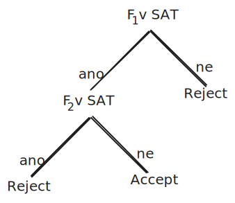

# Polynomiální hierarchie
*Definice:* Pro třídu jazyků $\mathscr{C}$ definujeme $\text{co-}\mathscr{C}$ jako 
$$
\text{co-}\mathscr{C} = \{ \overline{L} \mid L \in \mathscr{C} \}, \text{pro } \overline{L} = \Sigma^* \setminus L.
$$
*Definice:* Třídy jazyků $\Sigma_{0}, \Sigma_{1},\Sigma_{2},\dots$, $\Pi_{0},\Pi_{1},\Pi_{2},\dots$, $\Delta_{0},\Delta_{1},\Delta_{2},\dots$ definujme přepisem
- $\mathcal{P} = \Sigma_{0} = \Pi_{0} = \Delta_{0}$,
- $\forall k\geq{0}: \Sigma_{k+1} = NP(\Sigma_{k})$,
- $\forall k\geq 0:\Pi_{k+1} = \text{co-}NP(\Sigma_{k})$,
- $\forall k\geq 0: \Delta_{k+1} = P(\Sigma_{k})$.

*Definice:* Strukturou, které říkáme **Polynomiální hierarchie**, rozumíme $\mathcal{PH}= \bigcup_{k=0}^\infty \Sigma_{k}$.
- $\Sigma_{1} = NP(\mathcal{P}) =\mathcal{NP}$, 
- $\Sigma_{2} = NP(\mathcal{NP})$
- Pokud $\mathcal{P} = \mathcal{NP}$, pak $\mathcal{PH}$ kolabuje a $\mathcal{PH}= \mathcal{P}$.

### *Věta:* $\mathcal{PH} \subseteq PSPACE$
*Důkaz:* Indukce na $k$, kde pro $k=0$ máme $\Sigma_{0} = \mathcal{P} \subseteq PSPACE$.

Předpokládejme, že $\Sigma_{k} \subseteq PSPACE$, pak máme $\Sigma_{k+1} \stackrel{\text{def.}}{=} NP(\Sigma_{k}) \stackrel{}{\subseteq} PSPACE(\Sigma_{k}) \stackrel{\text{IP}}{\subseteq} PSPACE(PSPACE) \stackrel{\text{?}}{=} PSPACE$, stačí tedy dokázat $PSPACE(PSPACE) \subseteq PSPACE$, protože druhá strana je triviální.

Mějme $B\in PSPACE(PSPACE)$, tedy pro něj existuje DTS $M$ s orákulem $A$, který ho v polynomiálním prostoru rozhoduje $B = L(M,A)$, protože $A\in NSPACE$, tak pro něj existuje DTS $M'$, který $A$ rozhoduje v polynomiálním prostoru. Zkonstruujme $M''$ s $L(M'') = B$, který
1. Simuluje $M$ dokud nedojde na $\text{DOTAZ}$.
2. Simuluje se $M'$ v poly-prostoru a vydá odpověď na $\text{DOTAZ}$, jako $\text{Ano}$/$\text{Ne}$. (smaže se páska)
3. Pokračujeme v simulaci $M$ s dotazy na simulované orákulum dokud přijme/odmítne.

$M$ z definice pracuje v polynomiálním prostoru, stejně jako $M'$, takže $M''$ rozhoduje jazyk $B$ v polynomiálním prostoru, protože i kdyby $M$ více než polynomiálně-krát vyvolalo $\text{DOTAZ}$ tak to nevadí, protože se vždy na oracle pásce jen znovu spustí $M'$, takže se jen znovu užívá stejného polynomiálně velkého prostoru.

Dostáváme tedy, že $\forall A \in PSPACE(PSPACE): A \in PSPACE$, takže platí indukční krok.

---
### *Věta:* $\mathcal{PH} = \bigcup_{k=0}^\infty \Sigma_{k} = \bigcup_{k=0}^\infty \Pi_{k} = \bigcup_{k=0}^\infty \Delta_{k}$.
*Důkaz:* $\Sigma_{k}\subseteq \Delta_{k+1}$, protože $\Delta_{k+1}= P(\Sigma_{k})$ tak to zjevně platí, protože můžeme vyrobit TS $M$ jako wrapper pro libovolné $L \in \Sigma_{k}$, tak aby $L(M)\in \Delta_{k+1}$, který jen přijme dle orákula.

$\Pi_{k} \subseteq \Delta_{k+1}$ stejně jako u $\Sigma_{k}=co-\Pi_{k}$, jen otočíme odpovědi orákula a máme doplněk.

---
# Úplnost
*Věta:* (A) $L \in co-NP$, (B) $L\in NPÚ \implies co-NP = NP$.

*Důkaz:* Mějme $L' \in NP$ libovolný. Z (B) dostáváme existenci DTS $M$ transduceru, který v polynomiálním čase pro vstup $x$ rozhodne
$$
x\in L' \iff M(x)\in L, \quad x \in \overline{L'} \iff M(x) \in \overline{L}.
$$
Zároveň z (A) dostáváme existenci NTS akceptoru $N$ pracujícího v polynomiálním čase a rozpoznávající jazyk $\overline{L} = L(N)$.

Zřetězíme-li $M,N$, tak vznikne NTS $T$ takový, že
$$
\overline{L'} = L(T) \implies \overline{L'} \in NP \implies L' \in co-NP.
$$
Navíc tuto konstrukci můžeme zobecnit pro $\forall k: \Sigma_{k}, \Pi_{k},\Delta_{k}$ a máme $\Sigma_{k} \cup \Pi_{k} \subseteq \Delta_{k+1}$.

*Tvrzení:* $NP \neq co-NP$, pak by $\Sigma_{1} \cup \Pi_{1} \subsetneqq \Delta_{2}$.

*Důkaz:* Mějme $L = \{ (\mathcal{F}_{1}, \mathcal{F}_{2}) \mid \mathcal{F}_{1} \in SAT, \mathcal{F}_{2} \in UNSAT \}$, $\mathcal{F}_{1},\mathcal{F}_{2}$ jsou úplné jazyky pro $NP,co-NP$ a zjevně $L\in\Delta_{2} = P(NP) = P(co-NP)$ protože nám stačí orákulum na $SAT$, z $NP$. Pak
1. $L\not\in NP$ pro spor předpokládejme opak, tedy $L' = \{ (1, \mathcal{F}_{2}) \mid \mathcal{F}_{2} \in UNSAT \} \in NP$, víme, že $L'$ je $co-NP$ úplný a tedy $NP = co-NP$ a tedy spor.
2. $L\not\in co-NP$ sporem, mějme $L'=\{ (\mathcal{F}_{1}, 0)\mid \mathcal{F}_{1} \in SAT \} \in co-NP$, pak máme $L' \in \mathcal{NP}$ a $L' = SAT$ a tedy $\mathcal{NP} = co-\mathcal{NP}$ a máme opět spor.

---
# Věta o vztazích mezi $\Sigma_{k},\Pi_{k},\Delta_{k}$
### *Lemma 1:* $\mathcal{C}$ je libovolná třída jazyků z $\mathcal{PH}$ (tedy z $\Sigma_{k},\Pi_{k},\Delta_{k}$) pak $\forall A: A\in \mathcal{C} \iff A^* \in \mathcal{C}$, kde $A^* = \{ x\mid \exists n, \exists y_{1}\in A, \exists y_{2}\in A\dots \exists y_{n}\in A: x = (y_{1},y_{2},\dots,y_{n}) \}$.
Implicitně předpokládáme, že $(y_{1},y_{2},\dots,y_{n})$ nejsou v abecedě $A$, (tedy že oddělovače nejsou součástí abecedy jazyka $A$). 

*Důkaz:* $A^* \in \mathcal{C} \implies A\in \mathcal{C}$, protože $A \subseteq A^*$ pro $n=1$.

$A\in \mathcal{C} \implies A^* \in \mathcal{C}$ dokážeme rozborem případů:
1. $\mathcal{C} = \mathcal{P} = \Sigma_{0}=\Pi_{0}=\Delta_{0}=\Delta_{1}$ a máme $A\in \mathcal{P}\implies$ existuje DTS $M$ takový, že $A=L(M)$, na vstup $x=(y_{1},y_{2},\dots,y_{n})$ postupně spustíme $M$ $n$-krát a přijme $x\iff M$ přijal všechna $y_{i}$.
2. $\mathcal{C} = \Delta_{k}, k\geq 1$, tak funguje stejný argument jako pro (1.), pouze $M$ stroj s orákulem na jazyk z $\Sigma_{k-1}$.
3. $\mathcal{C}= \Sigma_{k}, k\geq{1}:A\in \Sigma_{k}\implies$ existence NTS $M:A=L(M,B)$ pro nějaké $B\in \Sigma_{k-1}$. Spustíme $M$ paralelně na všechny $y_{1},y_{2},\dots,y_{n}$ a pokud jeden odmítne tak odmítneme.
4. $\mathcal{C}=\Pi_{k}, k\geq {1}$, mějme $A\in \Pi_{k}$, takže $co-A\in \Sigma_{k}$, pro který existuje NTS $M$ s $co-A=L(M,B),B\in \Sigma_{k-1}$ a dle předešlého kroku máme $co-A^*\in \Sigma_{k}$ a $x=(y_{1},y_{2},\dots,y_{n})\in co-A^* \iff \exists {i}: y_{i}\in co-A$ a pomocí takového můžeme rozhodovat i $\Pi_{k}$.
---
### *Lemma 2:* $\mathcal{C}$ je libovolná třída jazyků z $\mathcal{PH}$ a nechť $A,B,C\in \mathcal{C}$. Pak jazyk $D\in \mathcal{C}$, kde $D=\{ (x,y,z)\mid x\in A, y\in B, z\in C\}$.
*Důkaz:* Idea stejná jako u *Lemma 1*, ale museli bychom brát konkrétní případy kombinace trojic.

---
*Definice:* Mějme $p(n)$ polynom a nechť $\mathcal{C}$ je třída jazyků, pak definujme
1. $\exists^{p(n)}x:R(x)$ znamená, že $\exists x:(|x|\leq p(n)) \land(x \text{ má vlastnost }R)$,
2. $\forall^{p(n)}x: R(x)$ znamená, že $\forall x: (|x|\leq p(n)) \land (x \text{ má vlastnost }R)$.
3. $A\in \exists \mathcal{C}$ pokud platí $\exists B \in \mathcal{C}, \exists p(n): x \in A \iff \exists^{p|x|} y: \left\langle x,y \right\rangle \in B$, jinými slovy existuje certifikát v polynomiální velikosti vzhledem k vstupu, který nám dovoluje $A$ rozhodovat pomocí jazyku v $\mathcal{C}$.
4. $A\in \forall \mathcal{C}$ pokud platí $\exists B\in \mathcal{C}, \exists p(n): x\in A \iff \forall^{p|x|}y: \left\langle x,y \right\rangle \in B$.

O $\mathcal{C}$ řekneme, že je uzavřená na zdrojování, pokud $\forall A\in \mathcal{C}: B= \{ \left\langle x,y \right\rangle \mid x\in A \} \in \mathcal{C}$, všechny v $\mathcal{PH}$ jsou takto uzavřeny.

---
### *Věta 1.:* Nechť $\mathcal{C}$ je libovolná třída jazyků, pak $A \in \exists C \iff \overline{A}\in \forall C$. Neboli platí, že $co-\exists \mathcal{C}=\forall(co-\mathcal{C})$. Pokud je $\mathcal{C}$ uzavřené na zdrojování, tak $\mathcal{C} \subseteq \exists\mathcal{C}, \mathcal{C} \subseteq \forall\mathcal{C}$.
*Důkaz:* Mějme $A\in \exists \mathcal{C}\implies \exists B\in \mathcal{C}, \exists p(x):x\in A\iff \exists^{p(|x|)} y: \left\langle x,y \right\rangle \in B$ a tedy $x\not\in A\iff \forall^{p(|x|)}y:\left\langle x,y \right\rangle\not \in B$ a to je definice $\overline{A}\in \forall C$, kde to $co-B$ je rozpoznávající.

Protože $\mathcal{C}$ je uzavřené na zdrojování, tak $A\in \mathcal{C}\implies B=\{ \left\langle x,y \right\rangle \mid x\in A \} \in \mathcal{C}$ a to jsou přesně prvky v $\forall \mathcal{C},\exists \mathcal{C}$.

---
### *Věta o vztazích $\mathcal{PH}$* 
1. $\exists \mathcal{P} =\mathcal{NP}$
2. $\forall \mathcal{P}=co-\mathcal{NP}$
3. $k>0:\exists\Sigma_{k} = \Sigma_{k}$
4. $k>0:\forall\Pi_{k} = \Pi_{k}$
5. $k>0: \exists \Pi_{k}=\Sigma_{k+1}$
6. $k>0: \forall \Sigma_{k} = \Pi_{k+1}$

*Důkaz:*
- (1.) $\implies$ (2.), protože $co-\mathcal{NP} \stackrel{\text{1.}}{=} co-\exists \mathcal{P} \stackrel{\text{Věta 1.}}{=} \forall(co-\mathcal{P}) = \forall \mathcal{P}$.
- (3.) $\implies$ (4.), protože $\forall\Pi_{k}=\forall (co-\Sigma_{k}) = co-\exists\Sigma_{k} \stackrel{3.}{=} co-\Sigma_{k} = \Pi_{k}$.
- (5.) $\implies$ (6.), protože $\forall \Sigma_{k} = \forall(co-\Pi_{k})=co-\exists\Pi_{k} \stackrel{\text{5.}}{=} co-\Sigma_{k+1}=\Pi_{k+1}$.
- (1. $\subseteq$) Nechť $A\in \exists \mathcal{P} \implies \exists B\in \mathcal{P},\exists p: \exists^{p|x|} y: \left\langle x,y \right\rangle \in B$ a existuje DTS $M$ rozhodující $B$ v polynomiálním čase. Zkonstruujeme NTS $M'$ pracující v polynomiálním čase takový, že $A=L(M')$. $M'$ nad vstupem $x$ přečte $x$ uhodne nedeterministicky $y$ a ověří, že $\left\langle x,y \right\rangle\in L(M)=B$ simulací $M$ a tedy $\exists P \subseteq \mathcal{NP}$.
- (1. $\supseteq$) $A\in \mathcal{NP}\implies \exists \text{ NTS } M$ pracující v polynomiálním čase s $A=L(M)$, definujme $B =\{ \left\langle x,y \right\rangle \mid x \in A, y \text{ je kód přijímacího výpočtu }M(x) \}\implies B\in \mathcal{P}$ a tedy $x\in A\iff \exists^{p|x|}y: \left\langle x,y \right\rangle\in B$.
- (3. $\subseteq$) Nechť $A\in \exists\Sigma_{k}$ libovolný, takže $\exists B\in \Sigma_{k},\exists p(n): x\in A \iff \exists^{p(|x|)}y:\left\langle x,y \right\rangle \in B$, kde $B\in\Sigma_{k}=NP(\Sigma_{k-1})$ a tedy existuje NTS $M$ pracující v polynomiálním čase pro který $\exists D\in \Sigma_{k-{1}}$, pro který platí $B=L(M,D)$. Zkonstruujeme NTS $M'$ pracující následovně:
	1. Přečte $x$ vstup,
	2. Nedeterministicky uhodne $y\leq p(|x|)$,
	3. Ověří zda $\left\langle x,y \right\rangle\in B$ simulací $M$.
	
  $A=L(M',D)\in NP(\Sigma_{k-1})=\Sigma_{k}$. Intuitivně si vlastně jedním nedeterminismem uhodneme více věcí: $(\exists y, \exists z) \equiv (\exists \left\langle y,z \right\rangle)$.
- (3. $\supseteq$) Platí dle *Věty 1.* a uzavřenosti na zdrojování.
- (5. $\subseteq$) $\exists\Pi_{k}\subseteq \Sigma_{k+{1}} = NP(\Sigma_{k})= NP(\Pi_{k}):A \in \exists \Pi_{k}: \exists B\in \Pi_{k},\exists p: x\in A \iff \exists^{p(|x|)}y:\left\langle x,y \right\rangle\in B.$ Máme NTS $M$, který přečte $x$, uhodne $y$ a ověří pomocí orákula $B$, zda $\left\langle x,y \right\rangle$ patří do $B$, kde $B$ je z $\Pi_{k}$, takže $M$ přijímající $A$ je z $NP(\Pi_{k})=\Sigma_{k+1}$.
- (5. $\supseteq$) Indukce dle $k$, pro $k=0:\Sigma_{1}\subseteq \exists\Pi_{0}\stackrel{\text{1.}}{=}\mathcal{NP}$. 

Předpokládejme, že pro $k-1$ platí $\exists\Pi_{k-1} \supseteq \Sigma_{k}$. Pak mějme libovolný $A \in \Sigma_{k+1}= NP(\Sigma_{k})$ a tedy $\exists B \in \Sigma_{k}\exists M$ NTS, že $A = L(M,B)$.  
$$
x \in A \iff \exists y, \exists v=(v_{1},\dots,v_{n}), \exists z=(z_{1},\dots,z_{n}): v_{i} \in B, z_{i}\in co-B
$$
a $y$ je certifikát kódující výpočet NTS $M$, ostatní slova jsou taková na které se algoritmus zeptá orákula $B$. Jinými slovy
$$
x\in A \iff \exists y,\exists v\in B^*, \exists z \in (co-B)^*: \left\langle x,y \right\rangle \in L, \text{pro } L\in \mathcal{P}
$$
$L$($\in \mathcal{P} \subseteq \Pi_{k-1}$) neověřuje výstupy orákula, ale simuluje $M$ s $y$ jako certifikátem.  Dle lemma 1. máme $B \in \Sigma_{k} \implies co-B\in \Pi_{k} \implies (co-B)^* \in \Pi_{k}$ a 
$$
B\in \Sigma_{k} \implies B^*\in \Sigma_{k} \stackrel{\text{IP.}}{\implies} B^* \in \exists\Pi_{k-1} \implies \exists D\in \Pi_{k-1}\exists p: v\in B^* \iff (\exists^{p(|v|)} t)\left\langle v,t \right\rangle \in D
$$
Tedy máme $L,D,(co-B)^*\in \Pi_{k}$ a definujeme
$$
E=\{ (a,b,c) \mid (a\in L)(b\in D)(c\in (co-B)^*) \}
$$
dle Lemma 2 je $E\in \Pi_{k}$, takže můžeme přepsat
$$
x\in A \iff \exists E\in \Pi_{k}, \exists^{p'(|x|)} y, \exists^{p'(|x|)} \left\langle v,t \right\rangle, \exists^{p'(|x|)} z: (\left\langle x,y \right\rangle, \left\langle v,t \right\rangle,z) \in E
$$
dostáváme tedy $\implies A \in \exists\Pi_{k}\implies \Sigma_{k+1} \subseteq \exists\Pi_{k}$.

---
#### *Důsledky:*
##### Definice $\mathcal{PH}$ pomocí alternujících kvantifikátorů.
$$
\begin{split}

A\in \Sigma_{k}\iff \exists B\in P, \text{polynom } p:x\in A\iff \exists^{p(|x|)}y_{1,}\forall^{p(|x|)}y_{2},\dots,Q^{p(|x|)}y_{n}: \\
(x,y_{1},\dots,y_{n})\in B
\end{split}
$$
$$
\begin{split}
A\in \Pi_{k}\iff \exists B\in P, \text{polynom } p:x\in A\iff \forall^{p(|x|)}y_{1,}\exists^{p(|x|)}y_{2},\dots,Q^{p(|x|)}y_{n}: \\
(x,y_{1},\dots,y_{n})\in B
\end{split}
$$
$$
\exists P = \Sigma_{1}, \forall P = \Pi_{1}, \Sigma_{2} = \exists\Pi_{1}=\exists \forall P, \Pi_{2} = \forall\
\Sigma_{1}=\forall\exists P 
$$
*Důkaz:* Indukcí pro $k=0: x\in A \iff \exists B\in P$ takové, že $x\in B$. 

Nechť platí pro $k$, pak
$$
A\in \Sigma_{k+1} = \exists\Pi_{k}: x\in A \iff (\exists B\in \Pi_{k},\exists p) \exists^{p(|x|)}y: \left\langle x,y \right\rangle \in B 
$$
dle IP máme $x\in A\iff \exists^{p(|x|)}y_{1,}\forall^{p(|x|)}y_{2},\dots,Q^{p(|x|)}y_{n}:  (x,y_{1},\dots,y_{n})\in D$ pro $D\in P$.
##### Kolaps $\mathcal{PH}$ na $k$-té hladině.
Pokud $\Pi_{k}=\Sigma_{k}\implies \forall j\geq 0: \Sigma_{k+j}=\Pi_{k+j}=\Sigma_{k}$ pro $k\geq 1$. 
- pro $j=0$ to zjevně platí
- pro $j>0$ předpokládejme platnost pro $j$, pak 
$$
\Sigma_{k+j+1} = \exists\Pi_{k+j} = \Pi_{k+j} = \Pi_{k}= \Sigma_{k}.
$$
#### Buď $\forall k\geq 0: \Sigma_{k} \subsetneqq \Sigma_{k+1}$, nebo se $\mathcal{PH}$ skládá z konečně mnoha tříd.
Kdyby $\exists k: \Sigma_{k}= \Sigma_{k+1} \implies \Sigma_{k}=\Pi_{k}$ a máme kolaps, dle důsledku 2. a máme
$$
\Sigma_{k} \cup \Pi_{k} \subseteq \Delta_{k+1} \subseteq \Sigma_{k+1} = \Sigma_{k}
$$
###### $\exists k$ takové, že $\Sigma_{0}\subsetneqq \Sigma_{k}\implies \mathcal{P} \subsetneqq \mathcal{NP}$.